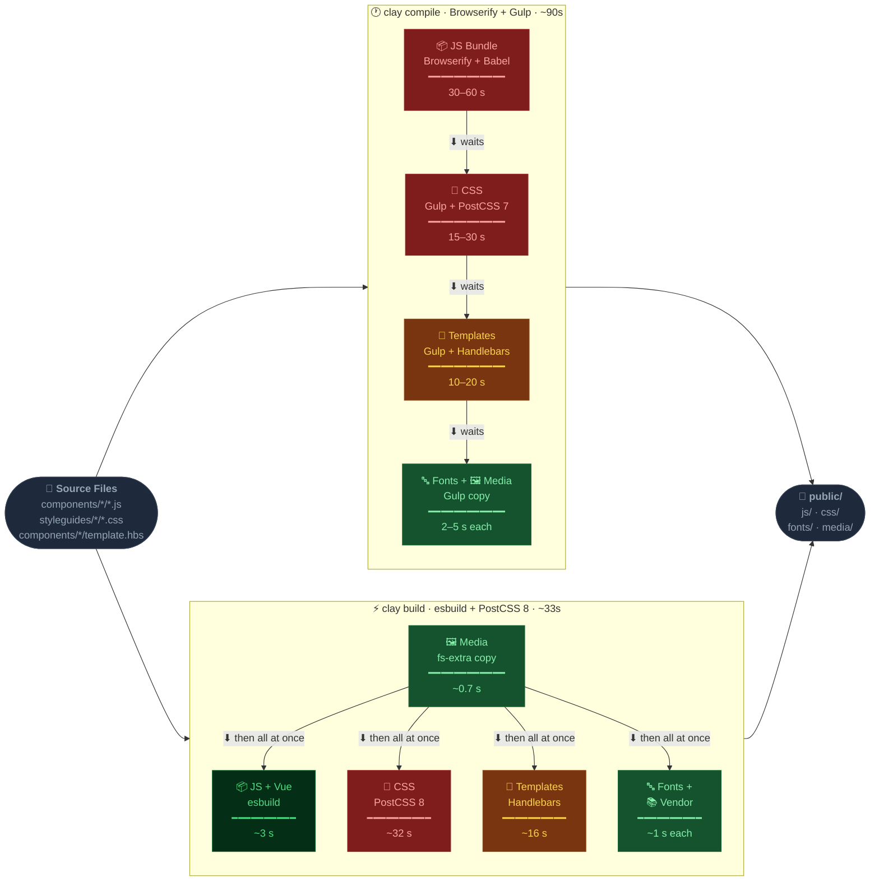

# clay build — New Asset Pipeline

> This document covers the **`clay build`** command introduced in claycli 5.1. It explains what changed from the legacy `clay compile` command, why, how they compare, and how to run both side-by-side.

---

## Table of Contents

1. [Why We Changed It](#1-why-we-changed-it)
2. [Commands At a Glance](#2-commands-at-a-glance)
3. [Architecture: Old vs New](#3-architecture-old-vs-new)
4. [Pipeline Comparison Diagram](#4-pipeline-comparison-diagram)
5. [Feature-by-Feature Comparison](#5-feature-by-feature-comparison)
6. [Configuration](#6-configuration)
7. [Running Both Side-by-Side](#7-running-both-side-by-side)
8. [Code References](#8-code-references)
9. [Performance](#9-performance)
10. [Learning Curve](#10-learning-curve)
11. [For Product Managers](#11-for-product-managers)
12. [Tests](#12-tests)
13. [Migration Guide](#13-migration-guide)

---

## 1. Why We Changed It

The legacy `clay compile` pipeline was built on **Browserify + Gulp**, tools designed for the 2014–2018 JavaScript ecosystem. Over time these became pain points:

| Problem | Impact |
|---|---|
| Browserify megabundle (all components in one file) | Any change = full rebuild, slow watch mode |
| Gulp orchestration with 20+ plugins | Complex dependency chain, hard to debug |
| Sequential compilation steps | CSS, JS, templates all ran in series |
| No native code-splitting | Every page loaded every component's JS |
| Babelify transpilation overhead | Slow even on small changes |
| `_registry.json` + `_ids.json` numeric module graph | Opaque, hard to inspect or extend |

The new `clay build` pipeline replaces Browserify/Gulp with **esbuild + PostCSS 8**:

- esbuild bundles JS/Vue in **milliseconds** (not seconds) with native code-splitting
- PostCSS 8's programmatic API replaces Gulp's stream-based CSS pipeline
- All build steps (JS, CSS, fonts, templates, vendor, media) run **in parallel**
- A human-readable `_manifest.json` replaces the numeric `_registry.json`/`_ids.json` pair
- Watch mode starts instantly — no initial build, only rebuilds what changed

---

## 2. Commands At a Glance

Both commands co-exist. You choose which pipeline to use.

### Legacy pipeline (Browserify + Gulp)

```bash
# One-shot compile
clay compile

# Watch mode
clay compile --watch
```

### New pipeline (esbuild + PostCSS 8)

```bash
# One-shot build
clay build

# Aliases (backward-compatible)
clay b
clay pn           # ← kept so existing Makefiles don't break
clay pack-next    # ← kept for the same reason

# Watch mode
clay build --watch

# Minified production build
clay build --minify
```

Both commands read **`claycli.config.js`** in the root of your Clay instance, but they look at **different config keys** so they never conflict (see [Configuration](#6-configuration)).

---

## 3. Architecture: Old vs New

### Old: `clay compile` (Browserify + Gulp)

```
clay compile
│
├── scripts.js  ← Browserify megabundler
│   ├── All component client.js files bundled into _modules-a-d.js … _modules-u-z.js
│   ├── All model.js + kiln.js files bundled into _models-*.js, _kiln-*.js
│   ├── _registry.json  ← numeric module ID graph (e.g. { "12": ["4","7"] })
│   ├── _ids.json       ← module ID to filename map
│   ├── _deps-*.js      ← shared dependency bundles
│   └── _client-init.js ← runtime that calls window.require() on each .client module
│
├── styles.js   ← Gulp + PostCSS 7
│   └── styleguides/**/*.css → public/css/{component}.{styleguide}.css
│
├── templates.js← Gulp + Handlebars precompile
│   └── components/**/template.hbs → public/js/*.template.js
│
├── fonts.js    ← Gulp copy + CSS concat
│   └── styleguides/*/fonts/* → public/fonts/ + public/css/_linked-fonts.*.css
│
└── media.js    ← Gulp copy
    └── components/**/media/* → public/media/
```

**Key runtime behaviour:** `_client-init.js` calls `window.require('article.client')` for **every** component at page-load, regardless of whether the component is on the page. Component modules execute their top-level code (e.g. `new Vue(...)`) at that point.

---

### New: `clay build` (esbuild + PostCSS 8)

```
clay build
│
├── build.js    ← esbuild (JS + Vue SFCs, code-split)
│   ├── Entry points: every components/**/client.js, model.js, kiln.js
│   ├── Code-split chunks: shared dependencies extracted automatically
│   ├── _manifest.json ← human-readable entry→file+chunks map
│   └── .clay/_view-init.js ← generated bootstrap (mounts components, sticky events)
│
├── styles.js   ← PostCSS 8 programmatic API (parallel, p-limit 20)
│   └── styleguides/**/*.css → public/css/{component}.{styleguide}.css
│
├── templates.js← Handlebars precompile (sequential, progress-tracked)
│   └── components/**/template.hbs → public/js/*.template.js
│
├── fonts.js    ← fs-extra copy + CSS concat
│   └── styleguides/*/fonts/* → public/fonts/ + public/css/_linked-fonts.*.css
│
├── vendor.js   ← fs-extra copy
│   └── clay-kiln/dist/*.js → public/js/
│
└── media.js    ← fs-extra copy
    └── components/**/media/* → public/media/
```

**Key runtime behaviour:** `_view-init.js` loads a component's `client.js` **only when that component's element exists in the DOM**. A built-in sticky-event shim ensures `auth:init` and similar events are received even by late subscribers.

---

## 4. Pipeline Comparison Diagram

Both pipelines share the same source files and produce the same `public/` output. The difference is in *how* the steps are wired together.



**Color guide:** 🔴 slow (&gt;15s) · 🟡 medium (10–20s) · 🟢 fast (&lt;5s) · 🌿 very fast (&lt;3s)

| | `clay compile` | `clay build` | Δ |
|---|---|---|---|
| **Total time** | ~60–120s | ~33s | **~2–3× faster** |
| **Execution** | Sequential — each step waits for the one before it | Parallel — all steps run simultaneously after media | — |
| **JS tool** | Browserify + Babel (megabundles) | esbuild (code-split per component) | — |
| **CSS tool** | Gulp + PostCSS 7 | PostCSS 8 programmatic API | — |
| **Module graph** | `_registry.json` + `_ids.json` | `_manifest.json` (human-readable) | — |
| **Component loader** | `_client-init.js` — mounts all components on load | `.clay/_view-init.js` — mounts only components in DOM | — |
| **JS output** | `_modules-a-d.js` megabundles | Per-component files + `chunks/` (shared code split) | — |
---

## 5. Feature-by-Feature Comparison

### JavaScript Bundling

| Aspect | `clay compile` (Browserify) | `clay build` (esbuild) |
|---|---|---|
| **Bundler** | Browserify 17 + babelify | esbuild |
| **Transpilation** | Babel (preset-env) | esbuild native (ES2017 target) |
| **Vue SFCs** | `@nymag/vueify` Browserify transform | `@nymag/vueify` esbuild plugin |
| **Bundle strategy** | Megabundle (all components in one file per alpha-bucket) | Code-split (shared chunks extracted automatically) |
| **Output** | `_modules-a-d.js` … `_modules-u-z.js` | `components/article/client-[hash].js` + shared `chunks/` |
| **Module graph** | `_registry.json` (numeric IDs) + `_ids.json` | `_manifest.json` (human-readable keys) |
| **Component loader** | `_client-init.js` loads ALL components at startup | `_view-init.js` loads component ONLY when its element is in DOM |
| **Full rebuild time** | ~30–60s | ~3–4s |
| **Watch rebuild** | Full rebuild on any change | Incremental: only changed module + its dependents |

> **Same result:** In both cases, the browser receives compiled, browser-compatible JavaScript. Component `client.js` logic runs when the component is on the page.

> **Key difference:** With Browserify, `new Vue(...)` at the top of a `client.js` runs at bundle-load time for EVERY component (even those not on the page). With esbuild + `_view-init.js`, it only runs when the component is present in the DOM.

---

### CSS Compilation

| Aspect | `clay compile` (Gulp + PostCSS 7) | `clay build` (PostCSS 8) |
|---|---|---|
| **API** | Gulp stream pipeline | PostCSS programmatic API |
| **Concurrency** | Sequential per-file | Parallel with `p-limit(20)` |
| **PostCSS plugins** | autoprefixer, postcss-import, postcss-mixins, postcss-simple-vars, postcss-nested | Same plugins |
| **Minification** | cssnano (when `CLAYCLI_COMPILE_MINIFIED` set) | cssnano (same flag) |
| **Error handling** | Stream error, halts pipeline | Per-file error logged, other files continue |
| **Output format** | `public/css/{component}.{styleguide}.css` | **Identical** |
| **Watch: CSS variation rebuild** | Recompiles changed file only | Recompiles all variations of the same component name (e.g. `article.css` change rebuilds `article_amp.css` too) |

> **Same result:** Output CSS files are byte-for-byte identical between pipelines (same PostCSS plugins, same naming convention).

> **Key difference:** In watch mode, `clay build` rebuilds all styleguide variants of a changed component. `clay compile` only rebuilt the exact file that changed, potentially leaving variation files stale.

---

### Template Compilation

| Aspect | `clay compile` (Gulp + clayhandlebars) | `clay build` (Node + clayhandlebars) |
|---|---|---|
| **API** | Gulp stream | Direct `fs.readFile` / `hbs.precompile` |
| **Output** | `public/js/{name}.template.js` | **Identical** |
| **Minified output** | `_templates-{a-d}.js` (bucketed) | **Identical** |
| **Error handling** | Stream error | Per-template error logged, compilation continues |
| **Progress tracking** | None | `onProgress(done, total)` callback → live % display |

> **Same result:** The `window.kiln.componentTemplates['name'] = ...` assignment format is identical.

---

### Fonts

| Aspect | `clay compile` | `clay build` |
|---|---|---|
| **Binary fonts** | Gulp copy to `public/fonts/{sg}/` | fs-extra copy, same dest |
| **Font CSS** | Concatenated to `_linked-fonts.{sg}.css` | **Identical** |
| **Asset host substitution** | `$asset-host` / `$asset-path` variables | **Identical** |

> **Same result:** Font CSS and binary output is identical.

---

### Module / Script Resolution

| Aspect | `clay compile` | `clay build` |
|---|---|---|
| **How scripts are resolved** | `getDependencies(scripts, assetPath)` reads `_registry.json`, walks numeric dep graph | `getDependenciesNextForComponents(names, assetPath, globalKeys)` reads `_manifest.json`, walks `imports` array |
| **API called from** | `resolveMedia.js` in your Clay instance | `resolveMedia.js` in your Clay instance |
| **Edit mode scripts** | All `_deps-*.js` + `_models-*.js` + `_kiln-*.js` + templates | `getEditScripts()` returns equivalent set from manifest |
| **View mode scripts** | Numeric IDs resolved to file paths | Human-readable component keys resolved to hashed file paths |

> **Same result:** Both pipelines return a list of `<script>` src paths that amphora-html injects into the page.

> **Key difference:** `clay build` only injects scripts for components actually on the page. `clay compile` injects the full megabundle (all components) regardless.

---

## 6. Configuration

Both commands read the same `claycli.config.js` at the root of your Clay instance, but use **separate config keys**:

```js
// claycli.config.js

// ─── Shared by BOTH pipelines ────────────────────────────────────────────────

// PostCSS import paths (used by both clay compile and clay build)
module.exports.postcssImportPaths = ['./styleguides'];

// PostCSS plugin customisation hook (used by both pipelines)
module.exports.stylesConfig = function(config) {
  // config.importPaths, config.autoprefixerOptions, config.plugins, config.minify
};

// ─── clay compile only (Browserify) ─────────────────────────────────────────

module.exports.babelTargets = { browsers: ['last 2 versions'] };
module.exports.babelPresetEnvOptions = {};

// ─── clay build only (esbuild) ───────────────────────────────────────────────

module.exports.esbuildConfig = function(config) {
  // Extend esbuild config — e.g. add aliases, define globals, extra entry points.
  // config is the full esbuild BuildOptions object.
  //
  // Example (from sites/claycli.config.js):
  config.alias = {
    ...config.alias,
    // Redirect server-only packages to browser stubs
    '@sentry/node': path.resolve('./services/client/error-tracking.js'),
  };
};
```

### Minimal setup for `clay build` (new tooling only)

For a Clay instance that hasn't used the old compile pipeline, you only need:

```js
// claycli.config.js — minimal setup for clay build
'use strict';
const path = require('path');

// PostCSS customisation (optional — defaults work for most sites)
module.exports.stylesConfig = function(config) {
  config.importPaths = ['./styleguides'];
};

// esbuild customisation (optional — only add what you actually need)
module.exports.esbuildConfig = function(config) {
  // Add aliases for server-only packages that get imported in universal code
  // config.alias['server-only-package'] = path.resolve('./browser-stub.js');
};
```

---

## 7. Running Both Side-by-Side

Both commands are fully independent. You can run either one without affecting the other.

### Using Makefile targets (recommended)

```makefile
# sites/Makefile

# New pipeline (esbuild)
compile:
  docker compose exec app npm run build:assets

watch:
  docker compose exec app npx clay build --watch

# Legacy pipeline (Browserify) — still works, still available
compile-legacy:
  docker compose exec app npx clay compile

watch-legacy:
  docker compose exec app npx clay compile --watch
```

### Using npm scripts

```json
{
  "scripts": {
    "build:assets": "npx clay build",
    "watch:assets": "npx clay build --watch",
    "build:legacy": "npx clay compile",
    "watch:legacy": "npx clay compile --watch"
  }
}
```

### How to switch between pipelines

The only thing that changes between pipelines is which scripts are served by `resolveMedia.js`:

```js
// services/resolve-media.js in your Clay instance

// New pipeline
const clayBuild = require('claycli/lib/cmd/build');

// Legacy pipeline
// const clayCompile = require('claycli/lib/cmd/compile');

function resolveMedia(ref, locals) {
  if (clayBuild.hasManifest()) {
    // Use new manifest-based resolution
    return clayBuild.getDependenciesNextForComponents(componentNames, assetPath, GLOBAL_KEYS);
  }
  // Fall back to legacy
  // return clayCompile.getDependencies(scripts, assetPath);
}
```

---

## 8. Code References

### CLI entry points

| Command | File |
|---|---|
| `clay build` | [`cli/build.js`](cli/build.js) |
| `clay compile` | [`cli/compile/`](cli/compile/) |
| Command routing | [`cli/index.js`](cli/index.js) — `b`, `pn`, `pack-next` all alias to `build` |

### Build pipeline modules

| Module | File | Old equivalent |
|---|---|---|
| Orchestrator (JS + all assets) | [`lib/cmd/build/build.js`](lib/cmd/build/build.js) | `lib/cmd/compile/scripts.js` |
| CSS compilation | [`lib/cmd/build/styles.js`](lib/cmd/build/styles.js) | `lib/cmd/compile/styles.js` |
| Template compilation | [`lib/cmd/build/templates.js`](lib/cmd/build/templates.js) | `lib/cmd/compile/templates.js` |
| Font processing | [`lib/cmd/build/fonts.js`](lib/cmd/build/fonts.js) | `lib/cmd/compile/fonts.js` |
| Media copy | [`lib/cmd/build/media.js`](lib/cmd/build/media.js) | `lib/cmd/compile/media.js` |
| Vendor (kiln) copy | [`lib/cmd/build/vendor.js`](lib/cmd/build/vendor.js) | Part of `lib/cmd/compile/scripts.js` |
| Manifest writer | [`lib/cmd/build/manifest.js`](lib/cmd/build/manifest.js) | _(no equivalent — replaces `_registry.json`/`_ids.json`)_ |
| Script dependency resolver | [`lib/cmd/build/get-script-dependencies.js`](lib/cmd/build/get-script-dependencies.js) | `lib/cmd/compile/get-script-dependencies.js` |

### esbuild plugins

| Plugin | File | Purpose |
|---|---|---|
| Vue 2 SFC | [`lib/cmd/build/plugins/vue2.js`](lib/cmd/build/plugins/vue2.js) | Compile `.vue` files (replaces `@nymag/vueify` Browserify transform) |
| Browser compat | [`lib/cmd/build/plugins/browser-compat.js`](lib/cmd/build/plugins/browser-compat.js) | Stub server-only Node.js modules (`fs`, `http`, `clay-log`, etc.) |
| Service rewrite | [`lib/cmd/build/plugins/service-rewrite.js`](lib/cmd/build/plugins/service-rewrite.js) | Rewrite `services/server/` imports to `services/client/` (replaces Browserify `rewriteServiceRequire` transform) |

### Generated files

| File | Generated by | Purpose |
|---|---|---|
| `public/js/_manifest.json` | `lib/cmd/build/manifest.js` | Human-readable entry→file+chunks map. Replaces `_registry.json` + `_ids.json`. |
| `.clay/_view-init.js` | `generateViewInitEntry()` in `build.js` | Component mounting bootstrap. Replaces `_client-init.js`. Includes sticky-event shim. |
| `.clay/_kiln-edit-entry.js` | `generateKilnEditEntry()` in `build.js` | Aggregates all `kiln.js` plugins for edit mode. |

### Watch mode (`clay build --watch`)

The watch implementation in `build.js` uses **chokidar** for all file types (JS, CSS, fonts, templates) rather than wrapping the build process. Key behaviours:

- **No initial build** on watch start — files are only rebuilt when they change
- **Ready signal** — "Watching for changes" is logged only after all chokidar watchers have emitted `'ready'`
- **CSS variation rebuild** — changing `article.css` rebuilds all `article_*.css` files across all styleguides
- **usePolling: true** — required for Docker + macOS volume mounts where inotify events are unreliable

```js
// lib/cmd/build/build.js — watch mode (simplified)
const chokidarOpts = {
  ignoreInitial: true,
  usePolling:    true,
  interval:      100,
  awaitWriteFinish: { stabilityThreshold: 50, pollInterval: 50 },
};
```

---

## 9. Performance

### Build time comparison (sites codebase, ~300 components)

| Step | `clay compile` | `clay build` | Notes |
|---|---|---|---|
| **JS bundling** | ~30–60s | ~3–4s | esbuild is written in Go; 10–20× faster than Browserify + Babel |
| **CSS** | ~15–30s (sequential) | ~32s (parallel, 2843 files) | Same PostCSS plugins, but now parallel across all files |
| **Templates** | ~10–20s | ~16s | Similar performance; progress tracking added |
| **Fonts/vendor/media** | ~2–5s | ~1s | Direct fs-extra copy vs Gulp stream overhead |
| **Total (full build)** | **~60–120s** | **~33s** | **2–4× faster overall** |
| **Watch JS rebuild** | ~30–60s (full rebuild) | ~0.3–1s (incremental) | **60–200× faster** for a single file change |
| **Watch CSS rebuild** | ~15s (full rebuild) | ~0.5–2s (changed file + variants) | ~10–30× faster |
| **Watch startup** | ~5–15s (initial build) | ~0.2s (no initial build) | Watchers start instantly |

### Memory

- `clay compile`: Browserify holds the full dependency graph + all file contents in memory (~300–600 MB for large codebases)
- `clay build`: esbuild is incremental and releases memory between builds (~50–150 MB typical)

### Disk output

- `clay compile`: ~1 large bundle per alpha-bucket (hundreds of KB each)
- `clay build`: many small per-component files + shared chunks. HTTP/2 multiplexing makes this efficient in production; individual files are easier to cache-bust.

---

## 10. Learning Curve

### For Developers

| Topic | `clay compile` | `clay build` |
|---|---|---|
| **Debugging a build error** | Gulp stack trace through 5+ plugins, hard to attribute | Direct esbuild error: file, line, column |
| **Understanding the output** | `_registry.json` with numeric IDs, requires `_ids.json` to decode | `_manifest.json` is human-readable JSON |
| **Adding a new package** | May require a Browserify transform or browser-field shim | Add to `esbuildConfig.alias` or `browser-compat.js` |
| **Vue SFCs** | `@nymag/vueify` Browserify transform | `@nymag/vueify` esbuild plugin (same library, different adapter) |
| **Global variables (DS, Eventify)** | Implicit — available because Browserify didn't use strict module scope | Explicit — defined via `esbuild define` (`DS: 'window.DS'`) |
| **Server-only imports in universal code** | `rewriteServiceRequire` Browserify transform | `service-rewrite.js` esbuild plugin (same concept) |
| **`process.env.NODE_ENV`** | Set in `_client-init.js` at runtime | Set via `esbuild define` at build time |

**What's the same:**
- `claycli.config.js` is the single configuration entry point
- CSS uses the same PostCSS plugins with the same configuration API (`stylesConfig`)
- Output file locations and naming conventions are identical
- `resolveMedia.js` integration is the same pattern (call a function, get script paths)

**What's different:**
- Module loading is lazy (per-component) instead of eager (all-at-once)
- JS entry points are explicit file paths, not a single megabundle
- Globals must be explicitly declared rather than relying on Browserify's scope merging

---

### For Site Reliability Engineers

| Concern | `clay compile` | `clay build` |
|---|---|---|
| **Build reproducibility** | Browserify cache (`browserify-cache.json`) can cause stale builds | esbuild rebuilds from scratch; no cache files |
| **Docker volume mounts** | `chokidar` inotify events unreliable | `usePolling: true` explicitly configured |
| **CI build time** | 60–120s per build | ~33s per build (2–4× improvement) |
| **Health check** | No built-in indicator | `hasManifest()` returns `true` once a build has completed |
| **Partial builds** | Not supported — full rebuild only | Watch mode rebuilds only changed assets |
| **Output inspection** | `_registry.json` (opaque numeric IDs) | `_manifest.json` (human-readable, diffable) |
| **Node.js requirement** | Node ≥ 14 | Node ≥ 20 (esbuild requirement) |
| **Error surface** | Errors can silently swallow via Gulp stream | Errors are explicit — build exits non-zero |

---

## 11. For Product Managers

### What changed?

The way the codebase is compiled into browser-ready files was modernised. The underlying technology changed from Browserify (2014) to esbuild (2021). The end result — the website pages — looks and behaves identically to users.

### What improved?

1. **Developer velocity:** A developer changing one CSS file in watch mode now sees their change in ~0.5s instead of ~15s.
2. **Build reliability:** The new pipeline has no stateful cache files that can become stale. Every build produces the same output.
3. **Faster CI:** Full builds take ~33s instead of ~90s, reducing PR feedback loops.
4. **Easier debugging:** Build errors now show the exact file, line, and column. Previously errors were buried in Gulp stream traces.
5. **Better code splitting:** Only the JavaScript for components actually on a page is loaded, reducing page-load JavaScript.

### What's the risk?

- The old `clay compile` command still works — it's not removed. Teams can switch gradually.
- The new `clay build` produces functionally equivalent output verified by running both on the same codebase.
- A test suite covers all key functions of the new pipeline.

### Timeline / rollout

- Both pipelines are available simultaneously in claycli 5.1+
- Sites opt in to `clay build` by updating their `resolveMedia.js` and Makefile targets
- `clay compile` is preserved indefinitely for backward compatibility

---

## 12. Tests

Test files for the new pipeline live alongside each source module:

| Test file | What it covers |
|---|---|
| [`lib/cmd/build/manifest.test.js`](lib/cmd/build/manifest.test.js) | `writeManifest` — entry key derivation, chunk/import handling, public URL mapping |
| [`lib/cmd/build/styles.test.js`](lib/cmd/build/styles.test.js) | `buildStyles` — CSS compilation, `changedFiles` incremental mode, `onProgress`, `onError` routing |
| [`lib/cmd/build/templates.test.js`](lib/cmd/build/templates.test.js) | `buildTemplates` — HBS precompile, `onProgress`, error resilience in watch mode, minified bucket mode |
| [`lib/cmd/build/media.test.js`](lib/cmd/build/media.test.js) | `copyMedia` — component + layout media copy, count tracking |
| [`lib/cmd/build/get-script-dependencies.test.js`](lib/cmd/build/get-script-dependencies.test.js) | `hasManifest`, `getDependenciesNextForComponents` — chunk dedup, `_view-init` ordering, missing-component handling |

Run all new-pipeline tests:

```bash
npx jest lib/cmd/build/
```

Run the full test suite (all claycli tests):

```bash
npm test
```

---

## 13. Migration Guide

### Step 1 — Install claycli 5.1+

```bash
npm install claycli@^5.1.0-0
```

### Step 2 — Update `claycli.config.js`

Rename `packNextConfig` → `esbuildConfig` (if you had it). Remove any `packConfig` (webpack-era) blocks.

```js
// Before
module.exports.packNextConfig = function(config) { ... };

// After
module.exports.esbuildConfig = function(config) { ... };
```

### Step 3 — Update `resolveMedia.js`

```js
// Before (clay compile)
const clayCompile = require('claycli/lib/cmd/compile');
// ...
return clayCompile.getDependencies(scripts, assetPath);

// After (clay build)
const clayBuild = require('claycli/lib/cmd/build');
// ...
return clayBuild.getDependenciesNextForComponents(componentNames, assetPath, GLOBAL_KEYS);
```

### Step 4 — Update Makefile / npm scripts

```makefile
compile:
  docker compose exec app npm run build:assets  # was: clay compile

watch:
  docker compose exec app npx clay build --watch  # was: clay compile --watch
```

```json
{
  "scripts": {
    "build:assets": "npx clay build",
    "watch:assets": "npx clay build --watch"
  }
}
```

### Step 5 — Remove legacy output from `.gitignore` (optional)

Legacy files no longer produced:

```gitignore
# These are no longer generated by clay build:
# public/js/_registry.json
# public/js/_ids.json
# public/js/_modules-*.js
# public/js/_deps-*.js
# public/js/_client-init.js
# browserify-cache.json

# New files to ignore:
public/js/_manifest.json
.clay/
```

### Step 6 — Remove `pack-next-inject.js` (if present)

The `pack-next-inject.js` file (esbuild `inject` shim for `DS`, `Eventify`, `process`) is no longer needed. These are now handled via `esbuild define` in claycli's default config:

```js
// In claycli's build.js — no action needed in your clay instance:
define: {
  DS:          'window.DS',
  Eventify:    'window.Eventify',
  Fingerprint2:'window.Fingerprint2',
  global:      'globalThis',
  'process.browser': 'true',
  'process.env.NODE_ENV': JSON.stringify(process.env.NODE_ENV || 'development'),
},
```
