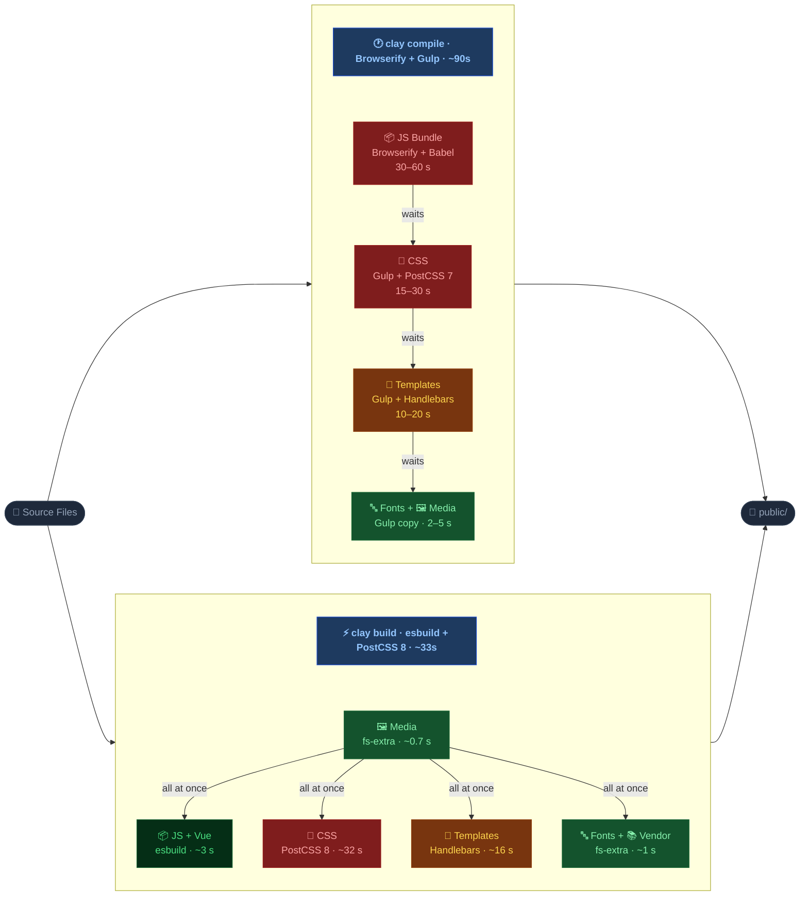

# clay build — New Asset Pipeline

> This document covers the **`clay build`** command introduced in claycli 5.1. It explains what changed from the legacy `clay compile` command, why, how they compare, and how to run both side-by-side.

---

## Table of Contents

1. [Why We Changed It](#1-why-we-changed-it)
2. [Commands At a Glance](#2-commands-at-a-glance)
3. [Architecture: Old vs New](#3-architecture-old-vs-new)
4. [Pipeline Comparison Diagram](#4-pipeline-comparison-diagram)
5. [Feature-by-Feature Comparison](#5-feature-by-feature-comparison)
6. [Configuration](#6-configuration)
7. [Running Both Side-by-Side](#7-running-both-side-by-side)
8. [Code References](#8-code-references)
9. [Performance](#9-performance)
10. [Learning Curve](#10-learning-curve)
11. [For Product Managers](#11-for-product-managers)
12. [Tests](#12-tests)
13. [Migration Guide](#13-migration-guide)

---

## 1. Why We Changed It

The legacy `clay compile` pipeline was built on **Browserify + Gulp**, tools designed for the 2014–2018 JavaScript ecosystem. Over time these became pain points:

| Problem | Impact |
|---|---|
| Browserify megabundle (all components in one file per alpha-bucket) | Any change = full rebuild of all component JS, slow watch mode |
| Gulp orchestration with 20+ plugins | Complex dependency chain, hard to debug, slow npm install |
| Sequential compilation steps | CSS, JS, templates all ran in series — total time = sum of all steps |
| No shared chunk extraction | If two components shared a dependency, each dragged it in separately via the Browserify registry |
| No tree shaking | Browserify bundled entire CJS modules regardless of how much was used; no support for ESM dependency tree shaking |
| No source maps | Build errors in production pointed to minified line numbers, not source |
| No content-hashed filenames | Static filenames (`article.client.js`) forced full cache invalidation on every deploy |
| Babelify transpilation overhead | Slow even on small changes |
| `_registry.json` + `_ids.json` numeric module graph | Opaque, hard to inspect or extend |
| `_prelude.js` / `_postlude.js` custom runtime | Browserify's own module system loaded on every page, adding baseline overhead |
| `browserify-cache.json` stale cache risk | Corrupted/out-of-sync cache produced builds where old module code was silently served |
| 20+ npm dependencies just for bundling | Large attack surface, slow installs, difficult version management |

The new `clay build` pipeline replaces Browserify/Gulp with **esbuild + PostCSS 8**:

- esbuild bundles JS/Vue in **milliseconds** (not seconds) with native code-splitting and tree shaking for ESM dependencies
- PostCSS 8's programmatic API replaces Gulp's stream-based CSS pipeline
- All build steps (JS, CSS, fonts, templates, vendor, media) run **in parallel**
- A human-readable `_manifest.json` replaces the numeric `_registry.json`/`_ids.json` pair
- Watch mode starts instantly — no initial build, only rebuilds what changed
- **Source maps** generated automatically — errors point to exact source file, line, and column
- **Content-hashed filenames** (`article/client-A1B2C3.js`) — browsers and CDNs cache files forever; only changed files get new URLs on deploy
- **Native ESM** output — no custom `window.require()` runtime, browsers handle imports natively
- **Build-time `process.env.NODE_ENV`** — dead branches like `if (process.env.NODE_ENV !== 'production')` are eliminated at compile time, not runtime
- Dependency footprint reduced from 20+ bundler packages to a handful

---

## 2. Commands At a Glance

Both commands co-exist. You choose which pipeline to use.

### Legacy pipeline (Browserify + Gulp)

```bash
# One-shot compile
clay compile

# Watch mode
clay compile --watch
```

### New pipeline (esbuild + PostCSS 8)

```bash
# One-shot build
clay build

# Aliases (backward-compatible)
clay b
clay pn           # ← kept so existing Makefiles don't break
clay pack-next    # ← kept for the same reason

# Watch mode
clay build --watch

# Minified production build
clay build --minify
```

Both commands read **`claycli.config.js`** in the root of your Clay instance, but they look at **different config keys** so they never conflict (see [Configuration](#6-configuration)).

---

## 3. Architecture: Old vs New

### Old: `clay compile` (Browserify + Gulp)

```
clay compile
│
├── scripts.js  ← Browserify megabundler
│   ├── Each component client.js → {name}.client.js  (individual file)
│   ├── Each component model.js  → {name}.model.js + _models-{a-d}.js (bucket in minified mode)
│   ├── Each component kiln.js   → {name}.kiln.js   + _kiln-{a-d}.js  (bucket in minified mode)
│   ├── Shared deps              → {number}.js       + _deps-{a-d}.js  (bucket in minified mode)
│   ├── _prelude.js / _postlude.js ← Browserify custom module runtime (window.require, window.modules)
│   ├── _registry.json  ← numeric module ID graph (e.g. { "12": ["4","7"] })
│   ├── _ids.json       ← module ID to filename map
│   └── _client-init.js ← runtime that calls window.require() on each .client module
│
├── styles.js   ← Gulp + PostCSS 7
│   └── styleguides/**/*.css → public/css/{component}.{styleguide}.css
│
├── templates.js← Gulp + Handlebars precompile
│   └── components/**/template.hbs → public/js/*.template.js
│
├── fonts.js    ← Gulp copy + CSS concat
│   └── styleguides/*/fonts/* → public/fonts/ + public/css/_linked-fonts.*.css
│
└── media.js    ← Gulp copy
    └── components/**/media/* → public/media/
```

**Key runtime behaviour:** `getDependencies()` in view mode walks `_registry.json` for only the components amphora placed on the page — it is page-specific. `_client-init.js` then calls `window.require(key)` for every `.client` key in `window.modules`, which is populated only by the scripts that were served. The subtle issue is that it mounts every loaded `.client` module regardless of whether that component's DOM element is actually present on the page.

---

### New: `clay build` (esbuild + PostCSS 8)

```
clay build
│
├── scripts.js    ← esbuild (JS + Vue SFCs, code-split)
│   ├── Entry points: every components/**/client.js, model.js, kiln.js
│   ├── Code-split chunks: shared dependencies extracted automatically
│   ├── _manifest.json ← human-readable entry→file+chunks map
│   └── .clay/_view-init.js ← generated bootstrap (mounts components, sticky events)
│
├── styles.js   ← PostCSS 8 programmatic API (parallel, p-limit 20)
│   └── styleguides/**/*.css → public/css/{component}.{styleguide}.css
│
├── templates.js← Handlebars precompile (sequential, progress-tracked)
│   └── components/**/template.hbs → public/js/*.template.js
│
├── fonts.js    ← fs-extra copy + CSS concat
│   └── styleguides/*/fonts/* → public/fonts/ + public/css/_linked-fonts.*.css
│
├── vendor.js   ← fs-extra copy
│   └── clay-kiln/dist/*.js → public/js/
│
└── media.js    ← fs-extra copy
    └── components/**/media/* → public/media/
```

**Key runtime behaviour:** `_view-init.js` loads a component's `client.js` **only when that component's element exists in the DOM**. A built-in sticky-event shim ensures `auth:init` and similar events are received even by late subscribers.

---

## 4. Pipeline Comparison Diagram

Both pipelines share the same source files and produce the same `public/` output. The difference is in *how* the steps are wired together.



**Color guide:** 🔴 slow (&gt;15s) · 🟡 medium (10–20s) · 🟢 fast (&lt;5s) · 🌿 very fast (&lt;3s)

| | `clay compile` | `clay build` | Δ |
|---|---|---|---|
| **Total time** | ~60–120s | ~33s | **~2–3× faster** |
| **Execution** | Sequential — each step waits for the one before it | Parallel — all steps run simultaneously after media | ⚠️ Different shape; same end result |
| **JS tool** | Browserify + Babel (megabundles) | esbuild (code-split per component) | 🔄 Replaced; esbuild is ~10–20× faster than Browserify |
| **CSS tool** | Gulp + PostCSS 7 | PostCSS 8 programmatic API | 🔄 Replaced; same PostCSS plugin ecosystem, newer API |
| **Module graph** | `_registry.json` + `_ids.json` | `_manifest.json` (human-readable) | ⚠️ Different format; same purpose (maps components → files) |
| **Component loader** | `_client-init.js` — mounts every loaded `.client` module, even if its DOM element is absent | `.clay/_view-init.js` — mounts only components whose DOM element is present | ✅ Better; avoids executing component code when the component isn't on the page |
| **JS output** | Per-component files + individual dep files, page-scoped via registry walk | Per-component files + `chunks/` (shared deps extracted once) | ✅ Better; shared deps are downloaded once even when multiple components use them |
---

## 5. Feature-by-Feature Comparison

### JavaScript Bundling

| Aspect | `clay compile` (Browserify) | `clay build` (esbuild) |
|---|---|---|
| **Bundler** | Browserify 17 + babelify | esbuild |
| **Transpilation** | Babel (preset-env) | esbuild native (ES2017 target) |
| **Vue SFCs** | `@nymag/vueify` Browserify transform | Custom esbuild plugin (`plugins/vue2.js`) using same underlying `vue-template-compiler` |
| **Bundle strategy** | Per-component files + alpha-bucket dep bundles (`_deps-a-d.js`) | Per-component files + auto-extracted shared `chunks/` |
| **Output filenames** | Static: `article.client.js` | Content-hashed: `components/article/client-A1B2C3.js` |
| **Module runtime** | `_prelude.js` + `_postlude.js` (custom `window.require`) | Native ESM — no runtime overhead |
| **Module graph** | `_registry.json` (numeric IDs) + `_ids.json` | `_manifest.json` (human-readable keys) |
| **Component loader** | `_client-init.js` mounts every `.client` module in `window.modules` (page-scoped, but not DOM-presence-checked) | `_view-init.js` mounts a component only when its DOM element exists |
| **Tree shaking** | None — CJS modules bundled whole; no ESM analysis | For ESM dependencies (packages that ship an ESM build): unused exports eliminated. CJS dependencies (e.g. classic `lodash`) are still bundled whole in both pipelines. |
| **Source maps** | Not generated | Yes — `*.js.map` alongside every output file |
| **Dead code elimination** | `process.env.NODE_ENV` set at runtime; dead branches survive minification | Set at build time via `define` — `if (dev) { ... }` blocks removed in production builds |
| **Full rebuild time** | ~30–60s | ~3–4s |
| **Watch rebuild** | Full rebuild on any change | Incremental: only changed module + its dependents |

> **Same result:** In both cases, the browser receives compiled, browser-compatible JavaScript. Component `client.js` logic runs when the component is on the page.

> **Key difference:** With Browserify, top-level side-effects in a `client.js` (e.g. `new Vue(...)`) run at page load for every component whose scripts were served, regardless of whether that component's DOM element is present. With esbuild + `_view-init.js`, component code runs only when the element is found in the DOM.

---

### CSS Compilation

| Aspect | `clay compile` (Gulp + PostCSS 7) | `clay build` (PostCSS 8) |
|---|---|---|
| **API** | Gulp stream pipeline | PostCSS programmatic API |
| **Concurrency** | Sequential per-file | Parallel with `p-limit(20)` |
| **PostCSS plugins** | autoprefixer, postcss-import, postcss-mixins, postcss-simple-vars, postcss-nested | Same plugins |
| **Minification** | cssnano (when `CLAYCLI_COMPILE_MINIFIED` set) | cssnano (same flag) |
| **Error handling** | Stream error halts the entire pipeline | Per-file error logged; remaining files continue compiling |
| **Output format** | `public/css/{component}.{styleguide}.css` | **Identical** |
| **Watch: CSS variation rebuild** | Recompiles changed file only | Recompiles all variations of the same component name (e.g. `article.css` change rebuilds `article_amp.css` too) |

> **Same result:** Output CSS files are byte-for-byte identical between pipelines (same PostCSS plugins, same naming convention).

> **Key difference:** In watch mode, `clay compile` ran the full CSS glob on every change and used `gulp-changed` (ctime comparison) to skip files whose output was already up-to-date — it had no awareness of component variants. `clay build` explicitly derives the component prefix from the changed filename (e.g. `text-list_amp.css` → prefix `text-list`) and rebuilds every matching variant (`text-list.css`, `text-list_amp.css`, etc.) across all styleguides in one pass.

---

### Template Compilation

| Aspect | `clay compile` (Gulp + clayhandlebars) | `clay build` (Node + clayhandlebars) |
|---|---|---|
| **API** | Gulp stream | Direct `fs.readFile` / `hbs.precompile` |
| **Output** | `public/js/{name}.template.js` | **Identical** |
| **Minified output** | `_templates-{a-d}.js` (bucketed) | **Identical** |
| **Error handling** | Stream error calls `process.exit(1)` — crashes the entire build on a single bad template | Per-template error logged; remaining templates continue compiling |
| **Missing `{{{ read }}}` file** | `process.exit(1)` — build crashes immediately | Error logged; template compiles with token unreplaced so the missing asset is visible in browser |
| **Progress tracking** | None | `onProgress(done, total)` callback → live % display |

> **Same result:** The `window.kiln.componentTemplates['name'] = ...` assignment format is identical.

---

### Fonts

| Aspect | `clay compile` | `clay build` |
|---|---|---|
| **Binary fonts** | Gulp copy to `public/fonts/{sg}/` | fs-extra copy, same dest |
| **Font CSS** | Concatenated to `_linked-fonts.{sg}.css` | **Identical** |
| **Asset host substitution** | `$asset-host` / `$asset-path` variables | **Identical** |

> **Same result:** Font CSS and binary output is identical.

---

### Module / Script Resolution

| Aspect | `clay compile` | `clay build` |
|---|---|---|
| **How scripts are resolved** | `getDependencies(scripts, assetPath)` reads `_registry.json`, walks numeric dep graph | `getDependenciesNextForComponents(names, assetPath, globalKeys)` reads `_manifest.json`, walks `imports` array |
| **Edit mode scripts** | All `_deps-*.js` + `_models-*.js` + `_kiln-*.js` + templates | `getEditScripts()` returns equivalent set from manifest |
| **View mode scripts** | Numeric IDs resolved to file paths | Human-readable component keys resolved to hashed file paths |

> **Same result:** Both pipelines return a list of `<script>` src paths that amphora-html injects into the page.

> **Key difference:** Both pipelines are page-scoped — only scripts for components on the page are served. The difference is granularity: `clay compile` serves individual dep files per the registry walk (with no deduplication across components); `clay build` extracts shared dependencies into chunks so a shared module is downloaded exactly once even when multiple page components use it.

---

## 6. Configuration

Both commands read the same `claycli.config.js` at the root of your Clay instance, but use **separate config keys**:

```js
// claycli.config.js

// ─── Shared by BOTH pipelines ────────────────────────────────────────────────

// PostCSS import paths (used by both clay compile and clay build)
module.exports.postcssImportPaths = ['./styleguides'];

// PostCSS plugin customisation hook (used by both pipelines)
module.exports.stylesConfig = function(config) {
  // config.importPaths, config.autoprefixerOptions, config.plugins, config.minify
};

// ─── clay compile only (Browserify) ─────────────────────────────────────────

module.exports.babelTargets = { browsers: ['last 2 versions'] };
module.exports.babelPresetEnvOptions = {};

// ─── clay build only (esbuild) ───────────────────────────────────────────────

module.exports.esbuildConfig = function(config) {
  // Extend esbuild config — e.g. add aliases, define globals, extra entry points.
  // config is the full esbuild BuildOptions object.
  //
  // Example (from sites/claycli.config.js):
  config.alias = {
    ...config.alias,
    // Redirect server-only packages to browser stubs
    '@sentry/node': path.resolve('./services/client/error-tracking.js'),
  };
};
```

### Minimal setup for `clay build` (new tooling only)

For a Clay instance that hasn't used the old compile pipeline, you only need:

```js
// claycli.config.js — minimal setup for clay build
'use strict';
const path = require('path');

// PostCSS customisation (optional — defaults work for most sites)
module.exports.stylesConfig = function(config) {
  config.importPaths = ['./styleguides'];
};

// esbuild customisation (optional — only add what you actually need)
module.exports.esbuildConfig = function(config) {
  // Add aliases for server-only packages that get imported in universal code
  // config.alias['server-only-package'] = path.resolve('./browser-stub.js');
};
```

---

## 7. Running Both Side-by-Side

Both commands are fully independent. You can run either one without affecting the other.

### `CLAYCLI_BUILD_ENABLED` — the single opt-in toggle

`CLAYCLI_BUILD_ENABLED=true` is the one knob that controls everything:

| Where | Effect |
|---|---|
| `.env` (local) | `make compile`, `make watch`, `make assets` pick the new pipeline |
| `Dockerfile` build arg | Installs claycli from `github:clay/claycli#jordan/yolo-update`; runs `clay build` at image-build time |
| `featurebranch-deploy.yaml` / `staging-deploy.yaml` build args | CI builds use the new pipeline |
| `resolveMedia.js` | `hasManifest()` returns `true` → new manifest-based script resolution is used |

When `CLAYCLI_BUILD_ENABLED` is **unset** (or not `"true"`), the old `clay compile` pipeline runs everywhere with zero changes needed.

### `GLOBAL_KEYS` ordering in `resolveMedia.js`

> **Important:** `aaa-module-mounting` must be the **first** entry in `GLOBAL_KEYS`.
>
> This script sets `window.DS`, `window.Eventify`, and `window.Fingerprint2` on the page. If any other global script runs first and tries to call `DS.service(...)` before `DS` is defined, you will see `Cannot read properties of undefined (reading 'service')` errors in the console.
>
> ```js
> // services/resolve-media.js — correct ordering
> const GLOBAL_KEYS = [
>   'aaa-module-mounting',  // ← MUST be first; sets window.DS, Eventify, Fingerprint2
>   'ads',
>   // ...other global scripts
> ];
> ```

### Using Makefile targets (recommended)

```makefile
# sites/Makefile — targets read CLAYCLI_BUILD_ENABLED automatically:
#
#   make compile  →  clay build  (if CLAYCLI_BUILD_ENABLED=true) or clay compile
#   make watch    →  clay build --watch  (if CLAYCLI_BUILD_ENABLED=true) or clay compile --watch
#   make assets   →  clay build --watch  (if CLAYCLI_BUILD_ENABLED=true) or clay compile --watch
```

### Using npm scripts

```json
{
  "scripts": {
    "build:assets":    "npx clay build",
    "watch:assets":    "npx clay build --watch",
    "build:compile":   "npx clay compile",
    "build:pack-next": "npx clay compile",
    "watch:compile":   "npx clay compile --watch"
  }
}
```

### How to switch between pipelines

The only thing that changes between pipelines is which scripts are served by `resolveMedia.js`. `hasManifest()` handles this automatically — it returns `true` only when `_manifest.json` exists (i.e. `clay build` ran), and falls back to the legacy `getDependencies` path otherwise:

```js
// services/resolve-media.js in your Clay instance

// New pipeline
const clayBuild = require('claycli/lib/cmd/build');

// Legacy pipeline
// const clayCompile = require('claycli/lib/cmd/compile');

function resolveMedia(ref, locals) {
  if (clayBuild.hasManifest()) {
    // Use new manifest-based resolution
    return clayBuild.getDependenciesNextForComponents(componentNames, assetPath, GLOBAL_KEYS);
  }
  // Fall back to legacy
  // return clayCompile.getDependencies(scripts, assetPath);
}
```

---

## 8. Code References

### CLI entry points

| Command | File |
|---|---|
| `clay build` | [`cli/build.js`](cli/build.js) |
| `clay compile` | [`cli/compile/`](cli/compile/) |
| Command routing | [`cli/index.js`](cli/index.js) — `b`, `pn`, `pack-next` all alias to `build` |

### Build pipeline modules

| Module | File | Old equivalent |
|---|---|---|
| Orchestrator (JS + all assets) | [`lib/cmd/build/scripts.js`](lib/cmd/build/scripts.js) | `lib/cmd/compile/scripts.js` |
| CSS compilation | [`lib/cmd/build/styles.js`](lib/cmd/build/styles.js) | `lib/cmd/compile/styles.js` |
| Template compilation | [`lib/cmd/build/templates.js`](lib/cmd/build/templates.js) | `lib/cmd/compile/templates.js` |
| Font processing | [`lib/cmd/build/fonts.js`](lib/cmd/build/fonts.js) | `lib/cmd/compile/fonts.js` |
| Media copy | [`lib/cmd/build/media.js`](lib/cmd/build/media.js) | `lib/cmd/compile/media.js` |
| Vendor (kiln) copy | [`lib/cmd/build/vendor.js`](lib/cmd/build/vendor.js) | Part of `lib/cmd/compile/scripts.js` |
| Manifest writer | [`lib/cmd/build/manifest.js`](lib/cmd/build/manifest.js) | _(no equivalent — replaces `_registry.json`/`_ids.json`)_ |
| Script dependency resolver | [`lib/cmd/build/get-script-dependencies.js`](lib/cmd/build/get-script-dependencies.js) | `lib/cmd/compile/get-script-dependencies.js` |

### esbuild plugins

| Plugin | File | Purpose |
|---|---|---|
| Vue 2 SFC | [`lib/cmd/build/plugins/vue2.js`](lib/cmd/build/plugins/vue2.js) | Compile `.vue` files (replaces `@nymag/vueify` Browserify transform) |
| Browser compat | [`lib/cmd/build/plugins/browser-compat.js`](lib/cmd/build/plugins/browser-compat.js) | Stub server-only Node.js modules (`fs`, `http`, `clay-log`, etc.) |
| Service rewrite | [`lib/cmd/build/plugins/service-rewrite.js`](lib/cmd/build/plugins/service-rewrite.js) | Rewrite `services/server/` imports to `services/client/` (replaces Browserify `rewriteServiceRequire` transform) |

### Generated files

| File | Generated by | Purpose |
|---|---|---|
| `public/js/_manifest.json` | `lib/cmd/build/manifest.js` | Human-readable entry→file+chunks map. Replaces `_registry.json` + `_ids.json`. |
| `.clay/_view-init.js` | `generateViewInitEntry()` in `scripts.js` | Synthetic esbuild entry point. Imports every `client.js` and mounts components on the page. Replaces `_client-init.js`. Includes sticky-event shim. |
| `.clay/_kiln-edit-init.js` | `generateKilnEditEntry()` in `scripts.js` | Synthetic esbuild entry point. Imports every `model.js` and `kiln.js` and registers them on `window.kiln.componentModels` / `window.kiln.componentKilnjs`. Replaces the Browserify `window.modules` registry that clay-kiln previously relied on. |

> **Why `.clay/` exists — and why the old pipeline didn't need it**
>
> Browserify uses a runtime module registry (`window.modules` / `window.require`). Every `client.js`, `model.js`, and `kiln.js` got wrapped in a factory and registered at runtime under a string key. Clay-kiln could call `window.require('components/article/model')` at any time and the registry handed it back — no pre-wiring needed.
>
> esbuild is a static bundler. It only bundles files that are explicitly connected via `import`/`require` at build time. To give esbuild an entry point that pulls in every component's model and kiln files, `scripts.js` generates the `.clay/` files on the fly before each build. esbuild requires real files on disk so it can resolve relative `import` paths and mirror the entry correctly into `public/js/` with a stable manifest key. `.clay/` is that staging area — build artifacts, not source code, so it belongs in `.gitignore`.

### Watch mode (`clay build --watch`)

The watch implementation in `scripts.js` uses **chokidar** for all file types (JS, CSS, fonts, templates) rather than wrapping the build process. Key behaviours:

- **No initial build** on watch start — files are only rebuilt when they change
- **Ready signal** — "Watching for changes" is logged only after all chokidar watchers have emitted `'ready'`
- **CSS variation rebuild** — changing `article.css` rebuilds all `article_*.css` files across all styleguides
- **usePolling: true** — required for Docker + macOS volume mounts where inotify events are unreliable

```js
// lib/cmd/build/scripts.js — watch mode (simplified)
const chokidarOpts = {
  ignoreInitial: true,
  usePolling:    true,
  interval:      100,
  awaitWriteFinish: { stabilityThreshold: 50, pollInterval: 50 },
};
```

---

## 9. Performance

### Build time comparison (sites codebase, ~300 components)

| Step | `clay compile` | `clay build` | Notes |
|---|---|---|---|
| **JS bundling** | ~30–60s | ~3–4s | esbuild is written in Go; 10–20× faster than Browserify + Babel |
| **CSS** | ~15–30s (sequential) | ~32s (parallel, 2843 files) | Same PostCSS plugins, but now parallel across all files |
| **Templates** | ~10–20s | ~16s | Similar performance; progress tracking added |
| **Fonts/vendor/media** | ~2–5s | ~1s | Direct fs-extra copy vs Gulp stream overhead |
| **Total (full build)** | **~60–120s** | **~33s** | **2–4× faster overall** |
| **Watch JS rebuild** | ~30–60s (full rebuild) | ~0.3–1s (incremental) | **60–200× faster** for a single file change |
| **Watch CSS rebuild** | ~15–30s (full glob + ctime filter) | ~1–3s (changed file + variants only) | ~10–15× faster |
| **Watch startup** | ~5–15s (initial build) | ~0.2s (no initial build) | Watchers start instantly |

### Memory

- `clay compile`: Browserify holds the full dependency graph + all file contents in memory (~300–600 MB for large codebases)
- `clay build`: esbuild is incremental and releases memory between builds (~50–150 MB typical)

### Disk output

- `clay compile`: flat `public/js/` with static filenames. Deploying any JS change requires invalidating the entire CDN cache for all JS files, since filenames never change.
- `clay build`: structured `public/js/components/…` + `public/js/chunks/` with **content-hashed filenames**. Only files that actually changed get new hashes on deploy — unchanged files (shared chunks, unmodified components) keep their old URLs and remain cached on CDN and in browsers indefinitely. This is the gold standard for long-lived caching.

### npm dependency footprint

The move from Browserify/Gulp to esbuild removes a significant number of packages:

| Removed (clay compile) | Added (clay build) |
|---|---|
| `browserify`, `babelify`, `@babel/preset-env` | `esbuild` |
| `gulp`, `highland`, `through2` | `postcss` (programmatic) |
| `browserify-cache-api` | `p-limit` |
| `browserify-extract-registry`, `browserify-extract-ids` | `cssnano` |
| `browserify-global-pack`, `bundle-collapser` | `@vue/component-compiler-utils` |
| `browserify-transform-tools`, `unreachable-branch-transform` | |
| `uglifyify`, `gulp-changed`, `gulp-replace`, `gulp-babel` | |
| `gulp-group-concat`, `gulp-cssmin`, `gulp-if`, `gulp-rename` | |
| `detective-postcss` | |

**Net result:** ~20 packages removed, ~5 added. Fewer packages means faster `npm install`, smaller `node_modules`, reduced supply-chain attack surface, and fewer version-conflict headaches.

---

## 10. Learning Curve

### For Developers

| Topic | `clay compile` | `clay build` |
|---|---|---|
| **Debugging a build error** | Gulp stack trace through 5+ plugins, hard to attribute to a source file | Direct esbuild error: exact file, line, column |
| **Debugging a runtime error** | Minified stack trace points to bundle line, not source | Source maps (`*.js.map`) generated automatically — browser DevTools show original source |
| **Understanding the output** | `_registry.json` with numeric IDs, requires `_ids.json` to decode | `_manifest.json` is human-readable JSON — open it and immediately understand which files are loaded for which component |
| **Adding a new package** | May require a Browserify transform or browser-field shim in the consuming repo | Add to `esbuildConfig.alias` in `claycli.config.js`, or it is automatically stubbed by `browser-compat.js` |
| **Vue SFCs** | `@nymag/vueify` Browserify transform | Custom esbuild plugin using same `vue-template-compiler` — identical output |
| **Global variables (DS, Eventify)** | Implicit — leaked into scope via Browserify's global module scope | Already defined in claycli's default config via `esbuild define`; no action needed unless adding new globals |
| **Server-only imports in universal code** | `rewriteServiceRequire` Browserify transform | `service-rewrite.js` esbuild plugin (same concept, same enforcement) |
| **`process.env.NODE_ENV`** | Set in `_client-init.js` at runtime — dead branches survive into the bundle | Set via `esbuild define` at build time — `if (process.env.NODE_ENV !== 'production') {}` blocks are eliminated in minified output |
| **Tree shaking** | None — `require('lodash')` pulled in the whole library | For ESM dependencies only — packages that ship an ESM build can be tree-shaken. CJS packages like `lodash` (not `lodash-es`) are still bundled whole. The main dead-code win is `process.env.NODE_ENV` build-time evaluation, not module-format conversion. |
| **Modern JS syntax** | Babel target must be configured separately | Controlled by `target` in `esbuildConfig` (default: Chrome 80+, Firefox 78+, Safari 14+) — `??`, `?.`, class fields all work out of the box |

**What's the same:**
- `claycli.config.js` is the single configuration entry point
- CSS uses the same PostCSS plugins with the same configuration API (`stylesConfig`)
- Output file locations and naming conventions are identical
- `resolveMedia.js` integration is the same pattern (call a function, get script paths)

**What's different:**
- Component code runs lazily (only when the component's DOM element is present) instead of at page load
- JS entry points are explicit per-component files, not a single megabundle shared across all components
- Standard Clay globals (`DS`, `Eventify`, `Fingerprint2`) are already handled in claycli's defaults; only site-specific globals need configuring

### Real-world time savings — watch mode ROI

> **Scenario:** 9 developers, each making 20 JS file changes/day during active development

```
                      | Old (clay compile) | New (clay build) | Saved
Per-change rebuild    | ~45s avg           | ~0.5s avg        | ~44.5s
Per-dev per day       | ~15 min waiting    | ~10s waiting     | ~14.8 min
Team per day (9 devs) | ~135 min (2.25 hr) | ~1.5 min         | ~133 min
Team per week         | ~11.25 hrs         | ~7.5 min         | ~11+ hrs
Team per year         | ~585 hrs           | ~6.5 hrs         | ~578 hrs

At $30/hr fully-loaded eng cost:
  Weekly savings:  ~$337
  Yearly savings:  ~$17,340
```

The bottleneck on most feature work is not writing code — it's waiting for the build. Watch mode eliminates that wait.

---

### For Site Reliability Engineers

| Concern | `clay compile` | `clay build` |
|---|---|---|
| **Build reproducibility** | `browserify-cache.json` can go stale, silently serving old module code | esbuild rebuilds from scratch every time; no cache file to corrupt |
| **Docker volume mounts** | `chokidar` inotify events unreliable on macOS volume mounts | `usePolling: true` explicitly configured |
| **CI build time** | 60–120s per build | ~33s per build (~63% reduction in CI compute minutes) |
| **Health check** | No built-in indicator | `hasManifest()` returns `true` once a build has completed |
| **Partial builds** | Not supported — full rebuild only | Watch mode rebuilds only changed assets |
| **Output inspection** | `_registry.json` (opaque numeric IDs, requires `_ids.json` to decode) | `_manifest.json` (human-readable JSON, easily `diff`-ed between deploys) |
| **CDN cache management** | Static filenames → must invalidate entire CDN cache on every JS deploy | Content-hashed filenames → only changed files get new URLs; unchanged files stay cached |
| **Rollback safety** | If build fails, `browserify-cache.json` may be left in a partial state | If build fails, the previous `_manifest.json` is untouched; `hasManifest()` continues to serve the last good build |
| **Source maps in production** | Not generated | `*.js.map` files allow production error stacks to point to source lines |
| **Node.js requirement** | Node ≥ 14 | Node ≥ 20 (esbuild requirement) |
| **Error surface** | Errors can be silently swallowed by Gulp stream error handlers | Errors are explicit — build exits non-zero, CI fails fast |

---

## 11. For Product Managers

### What changed?

The way the codebase is compiled into browser-ready files was modernised. The underlying technology changed from Browserify (2014) to esbuild (2021). The end result — the website pages — looks and behaves identically to users.

### What improved for the engineering team?

1. **Developer velocity:** A developer changing a JS file in watch mode sees their change in ~0.3–1s instead of ~30–60s. CSS changes: ~1–3s instead of ~15–30s. This compounds across every developer, every day.
2. **Build reliability:** No `browserify-cache.json` that can silently serve stale module code after a bad build. Every build is deterministic and reproducible.
3. **Faster CI:** Full builds take ~33s instead of ~90s — roughly a 63% reduction. For teams paying per CI minute (GitHub Actions, CircleCI), this directly reduces infrastructure cost on every pull request and deployment.
4. **Easier debugging:** Build errors show the exact file, line, and column. Source maps are generated automatically, so production error stack traces point to original source lines — not minified bundle line numbers.
5. **Better error resilience:** A single bad template or CSS file no longer crashes the entire build. Errors are logged and the rest of the build continues.
6. **Simpler dependency tree:** ~20 npm packages removed. Faster `npm install`, less supply-chain risk, fewer peer-dependency conflicts.

### What improved for the product — and why it matters to users?

#### Smaller JavaScript payloads (code splitting)

Both pipelines are page-scoped and both deduplicate shared dependencies — if `article` and `gallery` both depend on lodash, only one copy is served in either pipeline.

The difference is *where and when* that deduplication happens:

- **`clay compile`**: deduplication is a **runtime registry walk** on every page request — `getComputedDeps()` traverses `_registry.json` using a shared `out` object so each dep ID is included exactly once. The result is a list of individual numeric dep files (`123.js`, `456.js`, …) with static filenames.
- **`clay build`**: deduplication happens **at build time** — esbuild physically extracts the shared code into a named chunk file (`chunks/lodash-A1B2C3.js`). The manifest maps each component entry to its chunk list, so `resolveMedia` can serve the right files without any graph traversal at request time.

**Why the build-time approach is better:**
- Shared chunks have **content-hashed filenames** — they can be cached by CDNs and browsers indefinitely, surviving multiple deploys unchanged
- No per-request graph traversal — script resolution is a simple manifest lookup
- The chunk boundaries are visible and human-readable in `_manifest.json`; the old dep graph required both `_registry.json` and `_ids.json` to decode

**Why this matters:**
- Less JavaScript downloaded on every page load
- Less JavaScript parsed and executed by the browser before the page becomes interactive
- Dead code from dev-only branches (`process.env.NODE_ENV` evaluation) is eliminated at build time — React warnings, Vue dev checks, and similar guards are stripped entirely in production builds. ESM dependencies additionally benefit from export-level tree shaking.
- This directly improves **Time to Interactive (TTI)** and **Interaction to Next Paint (INP)** — two metrics Google measures

#### Core Web Vitals and SEO

Google uses [Core Web Vitals](https://web.dev/vitals/) as a direct ranking signal since 2021. The three metrics are:

| Metric | What it measures | How this change helps |
|---|---|---|
| **LCP** (Largest Contentful Paint) | How fast the main content loads | Less JS to download and parse means the browser reaches main content sooner. On repeat visits, content-hashed chunks load from cache instantly — even across deploys — directly improving LCP. |
| **INP** (Interaction to Next Paint) | How responsive the page feels to clicks/taps | Less JS to parse means the main thread is unblocked sooner. Component modules are also loaded on-demand (`_view-init.js` dynamic imports), spreading parse cost instead of hitting it all at once. |
| **CLS** (Cumulative Layout Shift) | Whether elements move around unexpectedly | No direct impact. |

**What drives the JS size reduction:**
- **Dead code elimination** — `process.env.NODE_ENV` is set to `'production'` at build time, stripping dev-only branches from libraries (React warnings, Vue checks, etc.) before they reach the browser. For dependencies that ship an ESM build, unused exports are also eliminated.
- **Better minification** — esbuild's minifier produces tighter output than the old `uglify-js`
- **Dead code elimination** — `process.env.NODE_ENV = 'production'` is baked in, so library dev-mode branches (React warnings, Vue checks, etc.) are stripped entirely
- **No Browserify runtime** — `_prelude.js` and `_postlude.js` (the custom `window.require` runtime) are no longer served on every page

**Honest caveat:** The magnitude of improvement depends on how much dead code and unused exports your bundles currently carry. The caching improvement (content-hashed filenames) is the most consistent and predictable win regardless of codebase size.

Better Core Web Vitals scores can improve organic search rankings. Pages that load faster and respond faster rank higher in Google Search.


#### CDN cache efficiency (infrastructure cost)

The old pipeline used static filenames (`article.client.js`). Every time any JavaScript changed, the entire cache had to be invalidated — browsers and CDNs re-downloaded every JS file, even those that hadn't changed.

The new pipeline uses **content-hashed filenames** (`components/article/client-A1B2C3.js`). Only files that actually changed get a new URL. Unchanged shared chunks, unmodified components, and vendor scripts keep their old URLs and stay cached for months on CDN and in browsers.

**Why this matters:**
- Lower CDN bandwidth cost — most files are cache hits after the first load
- Faster repeat page loads for returning users — cached files are reused across deploys
- On a high-traffic site, this can meaningfully reduce monthly CDN egress costs

#### Faster editing experience (Kiln)

The editing interface (Kiln) loads and feels faster too — not just the published pages.

In edit mode, the browser loads the Kiln interface bundle (`_kiln-plugins.js`) plus all component scripts for the page. Both are affected by this change:

- **Smaller Kiln bundle:** `_kiln-plugins.js` is now compiled with esbuild instead of vueify + Babel. Vue SFCs are compiled directly without the Babel intermediate step, producing a smaller and faster-loading kiln plugins bundle.
- **Smaller component scripts in edit mode:** The same dead code elimination and minification improvements that reduce view-mode payloads apply equally in edit mode — every component's script is smaller.
- **Cached kiln bundle across deploys:** The Kiln bundle now has a content-hashed filename. If no kiln plugins changed between deploys, editors' browsers reuse the cached version — no re-download, instant load.
- **Faster iteration for kiln plugin developers:** A developer working on a kiln plugin in watch mode sees changes in ~0.3–1s instead of ~30–60s. This compounds across every kiln plugin change during a development session.

**Bottom line:** Editors opening a page in Kiln should notice that the interface initialises faster, especially on repeat visits or after a deploy that didn't touch kiln plugins.

#### Operational confidence

- The build either fully succeeds and writes a new `_manifest.json`, or it fails and leaves the previous manifest untouched. There is no partial-success state.
- `hasManifest()` is a single boolean health check: if it returns `true`, a complete build exists and the site can serve scripts.
- Errors exit the build process with a non-zero code, so CI fails loudly instead of silently deploying a broken build.

### What's the risk?

- The old `clay compile` command still works — it's not removed. Teams can switch gradually.
- The new `clay build` produces functionally equivalent output verified by running both on the same codebase.
- A test suite covers all key functions of the new pipeline.

### Timeline / rollout

- Both pipelines are available simultaneously in claycli 5.1+
- Sites opt in to `clay build` by updating their `resolveMedia.js` and Makefile targets
- `clay compile` is preserved indefinitely for backward compatibility

---

## 12. Tests

Test files for the new pipeline live alongside each source module:

| Test file | What it covers |
|---|---|
| [`lib/cmd/build/manifest.test.js`](lib/cmd/build/manifest.test.js) | `writeManifest` — entry key derivation, chunk/import handling, public URL mapping |
| [`lib/cmd/build/styles.test.js`](lib/cmd/build/styles.test.js) | `buildStyles` — CSS compilation, `changedFiles` incremental mode, `onProgress`, `onError` routing |
| [`lib/cmd/build/templates.test.js`](lib/cmd/build/templates.test.js) | `buildTemplates` — HBS precompile, `onProgress`, error resilience in watch mode, minified bucket mode |
| [`lib/cmd/build/media.test.js`](lib/cmd/build/media.test.js) | `copyMedia` — component + layout media copy, count tracking |
| [`lib/cmd/build/get-script-dependencies.test.js`](lib/cmd/build/get-script-dependencies.test.js) | `hasManifest`, `getDependenciesNextForComponents` — chunk dedup, `_view-init` ordering, missing-component handling |

Run all new-pipeline tests:

```bash
npx jest lib/cmd/build/
```

Run the full test suite (all claycli tests):

```bash
npm test
```

---

## 13. Migration Guide

> **Why do any of these steps exist?**
>
> The old `clay compile` pipeline was built on Browserify, which wraps every module in a factory function and registers it in a runtime `window.modules` / `window.require` registry. Because all modules were registered at runtime under string keys, clay-kiln could call `window.require('components/article/model')` at any time and get the module back — no pre-wiring needed. The pipeline also owned a single `_client-init.js` file that mounted all components, and `getDependencies()` returned a flat list of pre-computed script paths baked into `_registry.json`.
>
> esbuild is a static bundler. It only bundles files that are explicitly connected via `import`/`require` at build time. There is no runtime module registry. This means things Browserify handled implicitly at runtime must now be handled explicitly at build time. Each step below exists because of that fundamental shift.

### Step 1 — Install claycli

```bash
npm install claycli@ version TBD
```

### Step 2 — Update `resolveMedia.js`

**Why this step exists:** The old `getDependencies()` function read from `_registry.json` and `_ids.json` — flat lookup files Browserify produced for every build. esbuild produces neither of those files. Instead it writes `_manifest.json`, a content-hashed entry-to-file map. The new `getDependenciesNextForComponents()` reads that manifest and resolves the correct hashed URLs per component. Without this change, `resolve-media.js` would try to read files that no longer exist and serve no scripts.

**Why you didn't need to change this before:** Browserify always produced `_registry.json` and `_ids.json` as part of every `clay compile` run. The API matched those files exactly. Nothing needed to change because the output format never changed.

```js
// Before (clay compile) — reads _registry.json + _ids.json
const clayCompile = require('claycli/lib/cmd/compile');
// ...
return clayCompile.getDependencies(scripts, assetPath);

// After (clay build) — reads _manifest.json
const clayBuild = require('claycli/lib/cmd/build');
// ...
return clayBuild.getDependenciesNextForComponents(componentNames, assetPath, GLOBAL_KEYS);
```

### Step 3 — Update Makefile / npm scripts

**Why this step exists:** The Makefile targets (`compile`, `watch`, `assets`) and npm scripts need to call `clay build` instead of `clay compile`. These are the commands humans and CI run — they need to point at the new pipeline.

**Why you didn't need to change this before:** `clay compile` was the only pipeline. There was nothing to switch between.

```makefile
compile:
  docker compose exec app npm run build:assets  # was: clay compile

watch:
  docker compose exec app npx clay build --watch  # was: clay compile --watch
```

```json
{
  "scripts": {
    "build:assets": "npx clay build",
    "watch:assets": "npx clay build --watch"
  }
}
```

### Step 4 — Add `.clay/` to `.gitignore`

**Why this step exists:** Before each build, `clay build` generates two synthetic entry files into a `.clay/` directory at the project root:

- `.clay/_kiln-edit-init.js` — imports every `model.js` and `kiln.js` across all components and registers them in `window.kiln.componentModels` / `window.kiln.componentKilnjs`. This is the aggregator that wires up clay-kiln's edit mode without the Browserify `window.modules` registry.
- `.clay/_view-init.js` — imports every `client.js` and mounts components on the page. Replaces `_client-init.js` and the old `components/init.js` that consuming repos used to own.

esbuild requires real files on disk as entry points — it resolves all `import` paths relative to the file's location. These generated files need to live at a known project-relative path so that esbuild's `outbase` can mirror them correctly into `public/js/` and the manifest keys remain stable. `.clay/` is that staging area. The files are build-time artifacts, not source code, so they must be excluded from git.

**Why you didn't need this before:** Browserify never needed explicit aggregator entry files. Its runtime `window.modules` registry was populated incrementally as each bundle was evaluated — no pre-generated file that imports everything was required. Clay-kiln just called `window.require()` and the registry handed it the right module.

```gitignore
# Generated by clay build before each esbuild run — not source code:
.clay/
```

### Step 5 — Remove legacy output from `.gitignore` (optional)

The following files are no longer produced by `clay build`. If your `.gitignore` references them you can remove or comment them out:

```gitignore
# These are no longer generated by clay build:
# public/js/_registry.json
# public/js/_ids.json
# public/js/_modules-*.js
# public/js/_deps-*.js
# public/js/_client-init.js
# browserify-cache.json

# New file to ignore (content-hashed manifest written on every build):
public/js/_manifest.json
```
