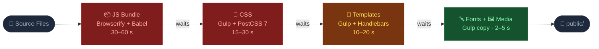
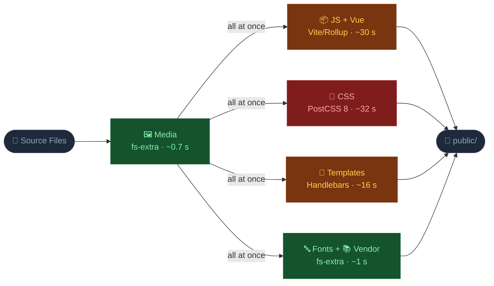
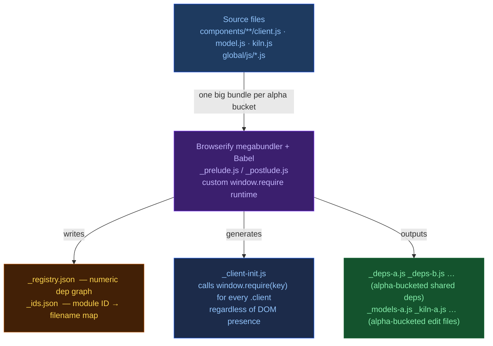
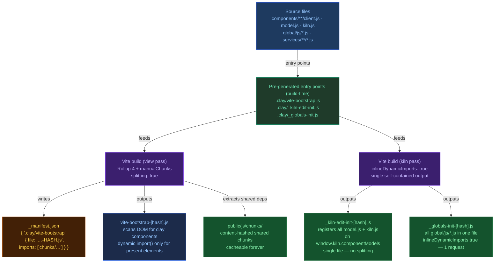
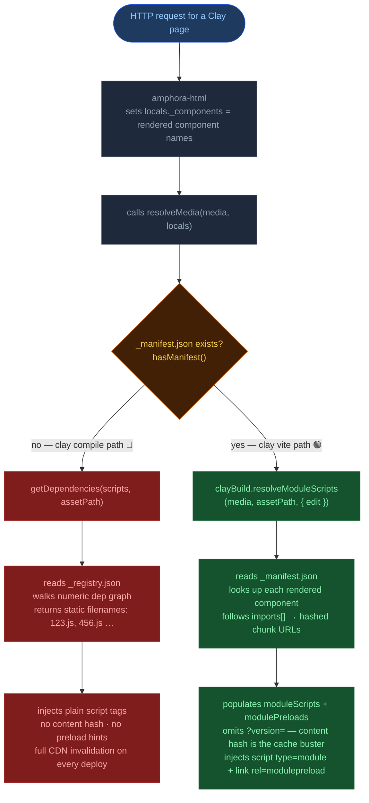

# clay vite — New Asset Pipeline

> This document covers the **`clay vite`** command — the new build pipeline for Clay instances.
> It explains what changed from the legacy `clay compile` (Browserify) pipeline, why, and
> how the two pipelines compare.
>
> **Why did we choose Vite over the other pipelines we tried?**
> See [`BUNDLER-COMPARISON.md`](./BUNDLER-COMPARISON.md) for the full technical rationale with
> measured performance data and a comparison of Browserify, esbuild, Rollup, and Vite.

## Table of Contents

1. [Why We Changed It](#1-why-we-changed-it)
2. [Commands At a Glance](#2-commands-at-a-glance)
3. [Architecture: Old vs New](#3-architecture-old-vs-new)
4. [Pipeline Comparison Diagrams](#4-pipeline-comparison-diagrams)
5. [Feature-by-Feature Comparison](#5-feature-by-feature-comparison)
6. [Configuration](#6-configuration)
7. [Running Both Side-by-Side](#7-running-both-side-by-side)
8. [Code References](#8-code-references)
   - [Why `_globals-init.js` exists as a separate file](#why-_globals-initjs-exists-as-a-separate-file)
   - [Why the build runs in two passes](#why-the-build-runs-in-two-passes)
   - [How client-env.json is generated](#how-client-envjson-is-generated)
9. [Performance](#9-performance)
10. [Learning Curve](#10-learning-curve)
11. [For Product Managers](#11-for-product-managers)
12. [Tests](#12-tests)
13. [Migration Guide](#13-migration-guide)
14. [amphora-html Changes](#14-amphora-html-changes)
15. [Bundler Comparison](#15-bundler-comparison)
16. [Services Pattern and Browser Bundle Hygiene](#16-services-pattern-and-browser-bundle-hygiene)

## 1. Why We Changed It

The legacy `clay compile` pipeline was built on **Browserify + Gulp**, tools designed for
the 2014–2018 JavaScript ecosystem. Over time these became pain points:

| Problem | Impact |
|---|---|
| Browserify megabundle (all components in one file per alpha-bucket) | Any change = full rebuild of all component JS, slow watch mode |
| Gulp orchestration with 20+ plugins | Complex dependency chain, hard to debug, slow npm install |
| Sequential compilation steps | CSS, JS, templates all ran in series — total time = sum of all steps |
| No shared chunk extraction | If two components shared a dependency, each dragged it in separately |
| No tree shaking | Browserify bundled entire CJS modules regardless of how much was used |
| No source maps | Build errors in production pointed to minified line numbers, not source |
| No content-hashed filenames | Static filenames (`article.client.js`) forced full cache invalidation on every deploy |
| `_prelude.js` + `_postlude.js` runtime (616 KB/page) | Every page carried an uncacheable Browserify module registry blob |
| `_registry.json` + `_ids.json` numeric module graph | Opaque, hard to inspect or extend |
| `browserify-cache.json` stale cache risk | Corrupted cache silently served old module code |
| 20+ npm dependencies just for bundling | Large attack surface, slow installs, difficult version management |

The new `clay vite` pipeline replaces Browserify/Gulp with **Vite 5 + PostCSS 8**:

- **Vite** uses Rollup 4 internally for production builds, adding `optimizeDeps` pre-bundling
  (esbuild converts CJS `node_modules` before Rollup sees them) and a well-maintained plugin
  ecosystem. We use Vite exclusively for its **production build** — the Vite dev server and
  HMR are not used. Clay runs a full server-rendered architecture (Amphora) where the browser
  never speaks directly to a Vite dev server; watch mode uses Rollup's incremental rebuild
  instead.
- PostCSS 8's programmatic API replaces Gulp's stream-based CSS pipeline
- All build steps (JS, CSS, fonts, templates, vendor, media) run **in parallel**
- A human-readable `_manifest.json` replaces the numeric `_registry.json` / `_ids.json` pair
- Watch mode uses Rollup's incremental rebuild — only changed modules are reprocessed
- **Source maps** generated automatically — errors point to exact source file, line, and column
- **Content-hashed filenames** (`chunks/client-A1B2C3.js`) — browsers and CDNs cache files
  forever; only changed files get new URLs on deploy
- **Native ESM** output — no custom `window.require()` runtime, browsers handle imports natively
- **Build-time `process.env.NODE_ENV`** — dead branches like `if (dev) {}` are eliminated at
  compile time, not runtime
- **`manualChunks` control** — small private modules are inlined into their owner's chunk,
  preventing the "hundreds of tiny files" problem that was inherent to Browserify and esbuild
- **Progressive ESM migration** — CJS compatibility shims are named, documented, and have clear
  "removed when" conditions; new components can be written as ESM from day one

## 2. Commands At a Glance

Both commands coexist. You choose which pipeline to use.

### Legacy pipeline (Browserify + Gulp)

```bash
# One-shot compile
clay compile

# Watch mode
clay compile --watch
```

### New pipeline (Vite + PostCSS 8)

```bash
# One-shot build
clay vite

# Watch mode
clay vite --watch

# Minified production build
clay vite --minify
```

Both commands read **`claycli.config.js`** in the root of your Clay instance, but they look at
**different config keys** so they never conflict (see [Configuration](#6-configuration)).

The environment variable `CLAYCLI_VITE_ENABLED=true` enables the Vite pipeline in Dockerfiles and CI.

## 3. Architecture: Old vs New

### Old: `clay compile` (Browserify + Gulp)

```
clay compile
│
├── scripts.js  ← Browserify megabundler
│   ├── Each component client.js → {name}.client.js  (individual file per component)
│   ├── Each component model.js  → {name}.model.js + _models-{a-d}.js (alpha-buckets)
│   ├── Each component kiln.js   → {name}.kiln.js   + _kiln-{a-d}.js  (alpha-buckets)
│   ├── Shared deps              → {number}.js + _deps-{a-d}.js (alpha-buckets)
│   ├── _prelude.js / _postlude.js ← Browserify custom module runtime (window.require, window.modules)
│   ├── _registry.json  ← numeric module ID graph (e.g. { "12": ["4","7"] })
│   ├── _ids.json       ← module ID to filename map
│   └── _client-init.js ← runtime that calls window.require() on each .client module
│
├── styles.js   ← Gulp + PostCSS 7
│   └── styleguides/**/*.css → public/css/{component}.{styleguide}.css
│
├── templates.js← Gulp + Handlebars precompile
│   └── components/**/template.hbs → public/js/*.template.js
│
├── fonts.js    ← Gulp copy + CSS concat
│   └── styleguides/*/fonts/* → public/fonts/ + public/css/_linked-fonts.*.css
│
└── media.js    ← Gulp copy
    └── components/**/media/* → public/media/
```

**Key runtime behaviour:** `getDependencies()` in view mode walks `_registry.json` for only
the components on the page. `_client-init.js` then calls `window.require(key)` for every
`.client` module in `window.modules` — even if that component's DOM element is absent.

### New: `clay vite` (Vite + PostCSS 8)

```
clay vite
│
├── scripts.js    ← Vite (Rollup 4 internally)
│   ├── View-mode pass (splitting: true):
│   │   ├── Entry: .clay/vite-bootstrap.js ← generated, dynamically imports each client.js
│   │   ├── Entry: .clay/_globals-init.js  ← generated, all global/js/*.js in one file
│   │   ├── Shared chunks → public/js/chunks/[name]-[hash].js  (content-hashed)
│   │   └── _manifest.json ← human-readable entry → file + chunks map
│   │
│   └── Kiln-edit pass (inlineDynamicImports: true):
│       ├── Entry: .clay/_kiln-edit-init.js ← generated, registers all model.js + kiln.js
│       └── Single output file: .clay/_kiln-edit-init-[hash].js
│
├── styles.js   ← PostCSS 8 programmatic API (parallel, p-limit 50)
│   └── styleguides/**/*.css → public/css/{component}.{styleguide}.css
│
├── templates.js← Handlebars precompile (parallel, p-limit 20, progress-tracked)
│   └── components/**/template.hbs → public/js/*.template.js
│
├── fonts.js    ← fs-extra copy + CSS concat
│   └── styleguides/*/fonts/* → public/fonts/ + public/css/_linked-fonts.*.css
│
├── vendor.js   ← fs-extra copy
│   └── clay-kiln/dist/*.js → public/js/
│
├── media.js    ← fs-extra copy
│   └── components/**/media/* → public/media/
│
└── client-env.json ← generated by viteClientEnvPlugin (createClientEnvCollector)
    └── collected as a side-effect of the Rollup transform pass — no extra file I/O
        (required by amphora-html's addEnvVars() at render time)
```

**Key runtime behaviour:** The Vite bootstrap (`_view-init.js`) dynamically imports a
component's `client.js` **only when that component's element exists in the DOM**.
`stickyEvents` in `claycli.config.js` configure a shim that replays one-shot events for
late subscribers (solving the ESM dynamic-import race condition — see Section 8).

## 4. Pipeline Comparison Diagrams

Both pipelines share the same source files and produce the same `public/` output. The
differences are in *how* steps are wired, *how* the JS module system works at runtime, and
*how* scripts are resolved and served per page.

### 4a. Build step execution (sequential vs parallel)

**🕐 Legacy — `clay compile` (Browserify + Gulp, ~90s)**



**⚡ New — `clay vite` (Vite + PostCSS 8, ~60s)**



**Color guide:** 🔴 slow (>15s) · 🟡 medium (10–20s) · 🟢 fast (<5s)

| | `clay compile` | `clay vite` | Δ |
|---|---|---|---|
| **Total time** | ~60–120s | ~60s | **~2× faster** |
| **Execution** | Sequential — each step waits | Parallel — all steps run simultaneously after media | ⚠️ Different shape; same end result |
| **JS tool** | Browserify + Babel (megabundles) | Vite (Rollup 4 + manualChunks) | 🔄 Replaced |
| **CSS tool** | Gulp + PostCSS 7 | PostCSS 8 programmatic API | 🔄 Replaced; same plugin ecosystem |
| **Module graph** | `_registry.json` + `_ids.json` | `_manifest.json` (human-readable) | ⚠️ Different format; same purpose |
| **Component loader** | `_client-init.js` — mounts every `.client` module loaded | `vite-bootstrap.js` — mounts only when DOM element present | ✅ Better; avoids dead code execution |
| **JS output** | Per-component files + alpha-bucket dep files | Dynamic import splits + `chunks/` shared deps | ✅ Better; shared deps cached once |

### 4b. JS module system architecture

This is the diagram that explains *why* so many other things had to change. The difference in
`resolve-media.js`, `_view-init`, `_kiln-edit-init`, and `_globals-init` all trace back to this.

**🕐 Legacy — `clay compile` (Browserify runtime module registry)**



**⚡ New — `clay vite` (Vite + Rollup static module graph)**



**🔁 Same in both pipelines:** CSS (PostCSS plugins → `public/css/`) · Templates (Handlebars precompile → `public/js/*.template.js`) · Fonts (copy + concat → `public/fonts/`) · Media (copy → `public/media/`)

| Concern | `clay compile` | `clay vite` | Why it matters |
|---|---|---|---|
| **Module registry** | Runtime: `window.modules` built as scripts evaluate | Build-time: `_manifest.json` written once | Old: any code could `window.require()` at any time. New: all wiring is static. |
| **Component mounting** | `_client-init.js` mounts every loaded `.client` module, DOM or not | `vite-bootstrap.js` scans DOM; only imports a component if its element exists | New: no dead component code execution |
| **Edit-mode aggregator** | `window.modules` registry | `_kiln-edit-init.js` pre-registers all model/kiln files on `window.kiln.componentModels` | New: explicit pre-wiring, backward compatible |
| **Shared deps** | Alpha-bucketed dep files (`_deps-a.js`…) — static filenames | Named content-hashed chunks in `public/js/chunks/` | New: unchanged chunks stay cached across deploys |
| **Global scripts** | Individual `<script>` tags per file | One `_globals-init.js` — 1 request instead of 70–100 | New: fewer network round-trips |
| **Cache strategy** | Static filenames → full CDN invalidation on every deploy | Content-hashed filenames → only changed files get new URLs | New: browsers cache files forever; warm loads re-download zero own JS |

### 4c. Per-page script resolution flow (runtime)

How the server decides which JS files to inject into a page response.



`hasManifest()` makes the two pipelines **hot-swappable**. Set `CLAYCLI_VITE_ENABLED=true` →
`_manifest.json` is written → new path activates. Remove the flag → `_manifest.json` is
absent on the next deploy → old path activates. No code changes needed in the site.

## 5. Feature-by-Feature Comparison

### JavaScript Bundling

| Aspect | `clay compile` (Browserify) | `clay vite` (Vite + Rollup) |
|---|---|---|
| **Bundler** | Browserify 17 + babelify | Vite 5 (Rollup 4 production, esbuild pre-bundler) |
| **Transpilation** | Babel (preset-env) | esbuild native (ES2017 target) |
| **Vue SFCs** | `@nymag/vueify` Browserify transform | `viteVue2Plugin` (same `vue-template-compiler`) |
| **Bundle strategy** | Per-component + alpha-bucket dep bundles | Dynamic import splits + `manualChunks` shared deps |
| **Output filenames** | Static: `article.client.js` | Content-hashed: `chunks/client-A1B2C3.js` |
| **Module runtime** | `_prelude.js` + `_postlude.js` (custom `window.require`) | Native ESM — no runtime overhead |
| **Module graph** | `_registry.json` (numeric IDs) + `_ids.json` | `_manifest.json` (human-readable keys) |
| **Component loader** | `_client-init.js` mounts every `.client` module in `window.modules` | `vite-bootstrap.js` mounts only when DOM element exists |
| **Chunk size control** | None — all or nothing per alpha-bucket | `manualChunksMinSize` — private deps inlined below threshold |
| **CJS circular deps** | Implicit (flat scope) | Explicit via `@rollup/plugin-commonjs strictRequires:'auto'` |
| **Tree shaking** | None | ESM packages: export-level; CJS: `process.env` dead-code elimination |
| **Source maps** | Not generated | Yes — `*.js.map` alongside every output file |
| **Dead code elimination** | `process.env.NODE_ENV` set at runtime | Set at build time via `define` — dead branches removed |
| **CJS→ESM migration** | No path | Progressive: each migrated file drops its CJS shim; `clientFilesESM` flag switches to native Rollup chunking |
| **Full rebuild time** | ~30–60s | ~30s |
| **Watch rebuild** | Full rebuild on any change | Rollup incremental: only changed module + dependents |

> **Same result:** In both cases, the browser receives compiled, browser-compatible JavaScript.
> Component `client.js` logic runs when the component is on the page.
>
> **Key difference:** With Browserify, top-level side-effects in a `client.js` run at page load
> for every component whose scripts were served, regardless of DOM presence. With Vite's
> bootstrap, component code runs only when the element is found in the DOM.

### CSS Compilation

| Aspect | `clay compile` (Gulp + PostCSS 7) | `clay vite` (PostCSS 8) |
|---|---|---|
| **API** | Gulp stream pipeline | PostCSS programmatic API |
| **Concurrency** | Sequential per-file | Parallel with `p-limit(50)` |
| **PostCSS plugins** | autoprefixer, postcss-import, postcss-mixins, postcss-simple-vars, postcss-nested | Same plugins |
| **Minification** | cssnano (when `CLAYCLI_COMPILE_MINIFIED` set) | cssnano (same flag) |
| **Error handling** | Stream error halts entire pipeline | Per-file error logged; remaining files continue |
| **Output format** | `public/css/{component}.{styleguide}.css` | **Identical** |
| **Future path** | Locked to PostCSS | Lightning CSS: `css: { transformer: 'lightningcss' }` in `baseViteConfig` |

> **Same result:** Output CSS files are byte-for-byte identical between pipelines.

### Template Compilation

| Aspect | `clay compile` (Gulp + clayhandlebars) | `clay vite` (Node + clayhandlebars) |
|---|---|---|
| **API** | Gulp stream | Direct `fs.readFile` / `hbs.precompile` |
| **Concurrency** | Sequential per-file | Parallel with `p-limit(20)` |
| **Output** | `public/js/{name}.template.js` | **Identical** |
| **Error handling** | `process.exit(1)` on first error | Per-template error logged; build continues |

### Module / Script Resolution

| Aspect | `clay compile` | `clay vite` |
|---|---|---|
| **How scripts are resolved** | `getDependencies()` reads `_registry.json` | `resolveModuleScripts()` reads `_manifest.json` |
| **Edit mode scripts** | All `_deps-*.js` + `_models-*.js` + `_kiln-*.js` + templates | Single `_kiln-edit-init` bundle + templates |
| **View mode scripts** | Numeric IDs → individual dep files | `vite-bootstrap` + `_globals-init` + shared chunks (typically 3–5 files) |
| **Global scripts** | Individual files per registry entry (70–100 requests) | All `global/js/*.js` in one `_globals-init.js` (1 request) |

## 6. Configuration

Both commands read the same `claycli.config.js` but use **separate config keys**:

```js
// claycli.config.js

// ─── Shared by BOTH pipelines ────────────────────────────────────────────────

// PostCSS import paths (used by both clay compile and clay vite)
module.exports.postcssImportPaths = ['./styleguides'];

// PostCSS plugin customization hook
module.exports.stylesConfig = function(config) {
  // config.importPaths, config.autoprefixerOptions, config.plugins, config.minify
};

// ─── clay compile only (Browserify) ─────────────────────────────────────────

module.exports.babelTargets = { browsers: ['last 2 versions'] };
module.exports.babelPresetEnvOptions = {};

// ─── clay vite only — sticky event shim ─────────────────────────────────────

// Events fired exactly once that may fire before a component's ESM module loads.
// See Section 8 (Sticky events) for the full rationale.
module.exports.stickyEvents = ['auth:init'];

// ─── clay vite only (Vite + Rollup) ─────────────────────────────────────────

module.exports.bundlerConfig = function(config) {
  // ── Chunk size tuning ───────────────────────────────────────────────────
  // Not set by default (= 0, no inlining). Suggested for CJS/mixed codebases:
  //   4096  (4 KB) — conservative     8192  (8 KB) — balanced, good starting point
  config.manualChunksMinSize = 8192;

  // ── ESM migration gates ─────────────────────────────────────────────────
  // Enable once all client.js files are native ESM — switches to Rollup's native
  // experimentalMinChunkSize instead of the custom manualChunks plugin.
  // config.clientFilesESM = false;
  //
  // Enable once all model.js/kiln.js are ESM — collapses the two-pass build.
  // config.kilnSplit = false;

  // ── Module aliases ──────────────────────────────────────────────────────
  // Simple specifier redirects. Applied at Rollup resolve time.
  // For complex patterns (regex, conditional), use config.plugins instead.
  config.alias = Object.assign({}, config.alias, {
    '@sentry/node': '@sentry/browser',   // redirect server-only SDK to browser build
  });

  // ── Identifier replacements ─────────────────────────────────────────────
  // Merged on top of built-ins (process.env.NODE_ENV, process.browser, __dirname, etc.)
  config.define = Object.assign({}, config.define, {
    DS:           'window.DS',       // project-specific global libraries
    Eventify:     'window.Eventify',
    Fingerprint2: 'window.Fingerprint2',
  });

  // ── Site-specific Rollup plugins ────────────────────────────────────────
  // Appended after built-in plugins. Uses standard Rollup plugin API.
  config.plugins = (config.plugins || []).concat([
    /* your custom plugins here */
  ]);

  return config;
};
```

### Minimal setup for `clay vite` (new tooling only)

```js
// claycli.config.js — minimal setup for clay vite
'use strict';

// PostCSS (optional — defaults work for most sites)
module.exports.stylesConfig = function(config) {
  config.importPaths = ['./styleguides'];
};

// Vite customization (optional — only add what you actually need)
module.exports.bundlerConfig = function(config) {
  // Adjust chunk inlining threshold (bytes). Omit to let Rollup split at every boundary.
  // config.manualChunksMinSize = 8192;
  return config;
};
```

### All `bundlerConfig` properties

| Property | Default | Purpose |
|---|---|---|
| `minify` | `false` | Force minification regardless of `CLAYCLI_COMPILE_MINIFIED` |
| `extraEntries` | `[]` | Extra absolute paths added to the view-mode splitting pass |
| `manualChunksMinSize` | `undefined` (= 0) | Byte threshold for private-dep inlining. 4096–8192 recommended for CJS codebases |
| `clientFilesESM` | `false` | Switch to native Rollup `experimentalMinChunkSize` when client JS is fully ESM |
| `kilnSplit` | `false` | Collapse two-pass build into one graph when model/kiln JS is fully ESM |
| `define` | `{}` | Extra identifier replacements merged on top of built-ins |
| `alias` | `{}` | Module specifier redirects — equivalent to Vite's `resolve.alias` |
| `sourcemap` | `true` | Emit `.js.map` files. Set to `false` in CI where source maps are not consumed |
| `plugins` | `[]` | Extra Rollup/Vite plugins appended after built-ins |
| `commonjsExclude` | `[]` | Patterns excluded from `@rollup/plugin-commonjs` rewriting |
| `browserStubs` | `{}` | Site-specific Node.js module stubs for the browser bundle |

## 7. Running Both Side-by-Side

Both commands are fully independent. You can run either one without affecting the other.

### `CLAYCLI_VITE_ENABLED=true` — the Vite pipeline toggle

| Where | Effect |
|---|---|
| `.env` (local) | `make compile`, `make watch`, `make assets` pick the Vite pipeline |
| `Dockerfile` build arg | Runs `clay vite` at image-build time |
| CI workflow build args (e.g. `featurebranch-deploy.yaml`) | CI builds use the Vite pipeline |
| `resolveMedia.js` | `hasManifest()` returns `true` → manifest-based script resolution activates |

When `CLAYCLI_VITE_ENABLED` is **unset** (or not `"true"`), the old `clay compile` pipeline runs
everywhere with zero changes needed.

### How to switch pipelines in the Dockerfile

```dockerfile
# Dockerfile build step — routes to the correct pipeline based on CLAYCLI_VITE_ENABLED
ARG CLAYCLI_VITE_ENABLED
ENV CLAYCLI_VITE_ENABLED=$CLAYCLI_VITE_ENABLED

RUN if [ "$CLAYCLI_VITE_ENABLED" = "true" ]; then \
        echo "✅ Running with clay vite..."; \
        npm run build:vite; \
    else \
        echo "✅ Running with clay compile (Browserify)..."; \
        npm run build:pack-next; \
    fi
```

### npm scripts

```json
{
  "scripts": {
    "build:vite":      "npx clay vite",
    "watch:vite":      "npx clay vite --watch",
    "build:compile":   "npx clay compile",
    "build:pack-next": "npx clay compile",
    "watch:compile":   "npx clay compile --watch"
  }
}
```

## 8. Code References

### CLI entry points

| Command | File |
|---|---|
| `clay vite` | [`cli/vite.js`](https://github.com/clay/claycli/blob/jordan/yolo-update/cli/vite.js) |
| `clay compile` | [`cli/compile/`](https://github.com/clay/claycli/tree/jordan/yolo-update/cli/compile) |

### Vite pipeline modules

| Module | File | Purpose |
|---|---|---|
| Orchestrator | [`lib/cmd/vite/scripts.js`](https://github.com/clay/claycli/blob/jordan/yolo-update/lib/cmd/vite/scripts.js) | Main build + watch orchestration; `getViteConfig`, `baseViteConfig`, `buildAll`, `watch` |
| Bootstrap generator | [`lib/cmd/vite/generate-bootstrap.js`](https://github.com/clay/claycli/blob/jordan/yolo-update/lib/cmd/vite/generate-bootstrap.js) | Generates `.clay/vite-bootstrap.js` with component mount runtime |
| Globals init generator | [`lib/cmd/vite/generate-globals-init.js`](https://github.com/clay/claycli/blob/jordan/yolo-update/lib/cmd/vite/generate-globals-init.js) | Generates `.clay/_globals-init.js` |
| Kiln edit generator | [`lib/cmd/vite/generate-kiln-edit.js`](https://github.com/clay/claycli/blob/jordan/yolo-update/lib/cmd/vite/generate-kiln-edit.js) | Generates `.clay/_kiln-edit-init.js` |
| CSS compilation | [`lib/cmd/vite/styles.js`](https://github.com/clay/claycli/blob/jordan/yolo-update/lib/cmd/vite/styles.js) | PostCSS pipeline; `buildStyles`, `SRC_GLOBS` |
| Template compilation | [`lib/cmd/vite/templates.js`](https://github.com/clay/claycli/blob/jordan/yolo-update/lib/cmd/vite/templates.js) | Handlebars precompile; `buildTemplates`, `TEMPLATE_GLOB_PATTERN` |
| Font processing | [`lib/cmd/vite/fonts.js`](https://github.com/clay/claycli/blob/jordan/yolo-update/lib/cmd/vite/fonts.js) | Font copy + CSS generation; `buildFonts`, `FONTS_SRC_GLOB` |
| Media copy | [`lib/cmd/vite/media.js`](https://github.com/clay/claycli/blob/jordan/yolo-update/lib/cmd/vite/media.js) | Copies media files to `public/media/`; `copyMedia` |
| Vendor copy | [`lib/cmd/vite/vendor.js`](https://github.com/clay/claycli/blob/jordan/yolo-update/lib/cmd/vite/vendor.js) | Copies `clay-kiln` dist files to `public/js/`; `copyVendor` |
| Manifest writer | [`lib/cmd/vite/scripts.js`](https://github.com/clay/claycli/blob/jordan/yolo-update/lib/cmd/vite/scripts.js) | `buildManifest`, `writeManifest` — writes `_manifest.json` |
| Script dependency resolver | [`lib/cmd/vite/index.js`](https://github.com/clay/claycli/blob/jordan/yolo-update/lib/cmd/vite/index.js) | `resolveModuleScripts`, `hasManifest` — runtime helpers for `resolve-media.js` |

### Vite plugins

| Plugin | File | Purpose |
|---|---|---|
| Vue 2 SFC | [`lib/cmd/vite/plugins/vue2.js`](https://github.com/clay/claycli/blob/jordan/yolo-update/lib/cmd/vite/plugins/vue2.js) | Compiles `.vue` files; replaces `@nymag/vueify` Browserify transform |
| Browser compat | [`lib/cmd/vite/plugins/browser-compat.js`](https://github.com/clay/claycli/blob/jordan/yolo-update/lib/cmd/vite/plugins/browser-compat.js) | Stubs server-only Node.js modules (`fs`, `http`, `clay-log`, etc.) |
| Service rewrite | [`lib/cmd/vite/plugins/service-rewrite.js`](https://github.com/clay/claycli/blob/jordan/yolo-update/lib/cmd/vite/plugins/service-rewrite.js) | Rewrites `services/server/` imports to `services/client/` |
| Missing module | [`lib/cmd/vite/plugins/missing-module.js`](https://github.com/clay/claycli/blob/jordan/yolo-update/lib/cmd/vite/plugins/missing-module.js) | Stubs unresolvable relative imports (legacy compatibility) |
| Manual chunks | [`lib/cmd/vite/plugins/manual-chunks.js`](https://github.com/clay/claycli/blob/jordan/yolo-update/lib/cmd/vite/plugins/manual-chunks.js) | `viteManualChunksPlugin` — inlines small private deps into owner chunk |

### Generated files

| File | Generated by | Purpose |
|---|---|---|
| `public/js/_manifest.json` | `lib/cmd/vite/scripts.js` (`buildManifest`/`writeManifest`) | Entry → file + chunks map. Replaces `_registry.json` + `_ids.json`. |
| `.clay/vite-bootstrap.js` | `generate-bootstrap.js` | Imports every `client.js`; mounts via dynamic `import()` on DOM presence |
| `.clay/_kiln-edit-init.js` | `generate-kiln-edit.js` | Imports every `model.js` + `kiln.js`; registers on `window.kiln.componentModels` |
| `.clay/_globals-init.js` | `generate-globals-init.js` | Imports all `global/js/*.js` into one non-splitting entry |
| `client-env.json` | `createClientEnvCollector` (Rollup plugin) | JSON array of `process.env.VAR_NAME` identifiers for `amphora-html` |

> **Why `.clay/` exists — and why the old pipeline didn't need it**
>
> Browserify used a runtime module registry (`window.modules` / `window.require`). Every
> `client.js`, `model.js`, and `kiln.js` was wrapped in a factory and registered under a string
> key. Clay-kiln could call `window.require('components/article/model')` at any time.
>
> Vite (via Rollup) is a static bundler. It only bundles files explicitly connected via
> `import`/`require` at build time. The `.clay/` generated files are the static entry points
> that pull in every component's model, kiln, and global scripts. They are build artifacts,
> not source code — `.clay/` belongs in `.gitignore`.

### Why `_globals-init.js` exists as a separate file

Clay's `global/js/*.js` files are **side-effect modules** — they set up `window.DS`,
`window.Eventify`, ad libraries, login state, and event buses. They have no exports and
exist purely to run on page load before anything else.

In the old Browserify pipeline this ordering was implicit: all global scripts were concatenated
synchronously into the bundle before any component code, so order was guaranteed by the
file-system sort order (hence `aaa-module-mounting.js` — the `aaa` prefix forces it first
lexicographically). There was nothing to configure; the bundler handled it by construction.

In Vite's ESM model, all component `client.js` files are loaded via **dynamic `import()`**
inside the bootstrap. Dynamic imports are async — they return a Promise and do not block
the current execution context. This creates a timing problem: a component's `client.js`
could mount and try to call `window.DS.add()` before any `global/js/*.js` file has run.

The fix is to use a **static import** in the bootstrap:

```js
// .clay/vite-bootstrap.js (generated)
import './_globals-init.js';  // ← STATIC: runs synchronously, blocks until complete

// _clayClientModules then runs dynamic import() — guaranteed to start AFTER globals
```

A static `import` is part of the module's static dependency graph. The browser (and Rollup
during bundling) resolves static imports depth-first before any code executes. Dynamic
`import()` calls only fire when the JavaScript engine reaches that line at runtime. So
`_globals-init.js` is guaranteed to fully execute before any component mounting begins,
regardless of network or parsing order.

`_globals-init.js` is generated as an intermediary barrel file — rather than scanning
`global/js/*.js` directly inside `generateViteBootstrap()` — for three reasons:

1. **Rollup entry-point control.** By being a separate Vite entry, globals are emitted as
   their own named output chunk in `public/js/`. This chunk is independently cacheable —
   globals like `ads.js` and `cid.js` rarely change between deploys, so the browser serves
   them from cache even when the bootstrap chunk gets a new hash. If globals were inlined
   directly in the bootstrap, every new component (which forces a bootstrap regeneration)
   would bust the globals cache too.

2. **Separation of concerns.** `generateViteBootstrap()` handles component discovery and
   mounting runtime. `generateViteGlobalsInit()` handles global aggregation. Each can change
   independently.

3. **Conditional inclusion.** The bootstrap generator checks `fs.pathExists(GLOBALS_INIT_FILE)`
   before emitting the static import. Projects with no `global/js/` directory skip this
   entirely with no configuration needed.

#### In a full ESM world

Once all `global/js/*.js` files are native ESM, the intermediary file becomes optional.
The glob scan could be inlined directly into `generateViteBootstrap()` and the static
imports emitted there. The ordering guarantee still holds — static imports in the generated
bootstrap still run before dynamic imports regardless of where in the file they appear.

The remaining benefit of keeping the barrel is the separate cache-able output chunk (point 1
above). Whether that trade-off is worth the extra generated file is a call for the ESM
migration phase. The `kilnSplit` flag (see below) demonstrates the pattern: once a
subsystem is fully ESM, its isolation constraint can be relaxed.

---

### Why the build runs in two passes

`clay vite` runs **two separate Vite build invocations** in parallel:

| Pass | Entry | Rollup setting | Output |
|---|---|---|---|
| View pass | `.clay/vite-bootstrap.js` + `_globals-init.js` | `splitting: true` | Many content-hashed chunks in `public/js/` |
| Kiln pass | `.clay/_kiln-edit-init.js` | `inlineDynamicImports: true` | Single monolithic file |

The two passes exist because **view mode and edit mode have fundamentally different output
shape requirements**, and Rollup cannot satisfy both in the same build graph.

#### View pass — splitting must be ON

The bootstrap dynamically imports each `client.js` via `import()`. For code splitting to
work — which is required to extract shared dependencies into cached chunks — Rollup must
have `splitting: true`. With splitting on, Rollup analyzes the entire module graph and
emits shared modules as independent files (`chunks/eventify-A1B2.js`, etc.) that the
bootstrap and individual component chunks reference.

#### Kiln pass — splitting must be OFF

`model.js` and `kiln.js` files register themselves on `window.kiln.componentModels` at the
time the file is evaluated. Clay-kiln initializes by iterating `window.kiln.componentModels`
synchronously. All model/kiln code must be present and executed **in one shot** before Kiln
starts.

If the kiln bundle were split (like the view pass), some `model.js` imports would be in
separate chunks that load asynchronously. Kiln would initialize before those chunks arrived,
resulting in components missing from the model registry.

`inlineDynamicImports: true` tells Rollup to collapse the entire graph — including any
`import()` calls — into a single output file. No chunk splitting. One request. Everything
synchronous.

#### Why they can't be merged

A single Rollup invocation uses one set of output options. `splitting: true` and
`inlineDynamicImports: true` are mutually exclusive. There is no configuration that produces
"split the client files but inline the kiln files" in the same pass — they require different
traversal strategies (splitting requires a chunk graph; inlining requires a depth-first
merge).

Running them in `Promise.all()` is free — both passes compile independently and write to
different output locations. The wall-clock cost is the longer of the two, not their sum.

#### `kilnSplit: false` — the ESM escape hatch

Once all `model.js` and `kiln.js` files are native ESM, the synchronous-initialization
constraint disappears. ESM `import` statements at the top of a file are resolved statically
by the module linker before any code runs, so there is no async gap for Kiln to initialize
into. Setting `kilnSplit: false` in `bundlerConfig` signals that the kiln pass can be
treated as a splitting pass, collapsing the two-pass build into one. This is the planned
final state after full ESM migration.

---

### How client-env.json is generated

`client-env.json` is a JSON array of `process.env.VAR_NAME` identifiers that `amphora-html`
reads at server startup. For every name in the array, `amphora-html` injects
`window.process.env.VAR = process.env.VAR` into the rendered page so that browser code
can read it at runtime.

#### The old way — grep scan (~30 seconds)

The previous implementation (`generateClientEnv`) ran a full file-system scan on every
build: glob-expand every `.js` and `.vue` file under `components/`, `layouts/`, `services/`,
`global/`, and `amphora/`, then `fs.readFile` each one sequentially, regex-match for
`process\.env\.([A-Z_][A-Z0-9_]*)`, and write the result.

Two problems:
1. **Speed** — O(N files), sequential I/O, ~30s standalone step on top of an already
   30-second JS build.
2. **Scope** — it scanned *all* source files, including server-only utilities and
   `model.js` hooks that call external APIs.  Server secrets like `STRIPE_API_SECRET`
   ended up in `client-env.json` even though no browser code ever reads them, creating
   unnecessary exposure in edit mode via `window.process.env`.

#### The new way — Rollup transform hook (effectively free)

`createClientEnvCollector` in `lib/cmd/vite/plugins/client-env.js` returns a pair:

- **`plugin()`** — a Rollup plugin whose `transform` hook scans each module as Rollup
  already processes it.  No extra file I/O — the source is already in memory.
- **`write()`** — flushes the accumulated Set to `client-env.json` after all passes complete.

Both the view pass and the kiln pass receive their own plugin instance from the same
collector, so a single `write()` call covers `process.env` references from both
`client.js` files and `model.js`/`kiln.js` files.

The scope boundary is now the Rollup module graph: only files that are actually imported
(directly or transitively) by `vite-bootstrap.js` or `_kiln-edit-init.js` contribute to
`client-env.json`.  Pure server-side utilities outside the graph — amphora route handlers,
`services/server/*` — are never seen by Rollup and are therefore never included, which
is exactly the right behavior.

```
Browserify pipeline:                  Vite pipeline:
  grep all *.js + *.vue ───► 30s        Rollup transform hook ──► ~0s
  (sequential, N files)                 (already traversing graph)
  includes server-only files            only files in module graph
  may expose server secrets             scope-bounded to browser surface
```

#### Watch mode behavior

In watch mode, the collector is created once for the entire session.  After every
incremental rebuild (`BUNDLE_END`), `write()` is called again with whatever is in the Set.
Because Rollup re-transforms any changed module, a newly added `process.env.MY_VAR`
reference is picked up automatically on the next rebuild.

The Set is intentionally **append-only** within a session — removing a reference leaves a
stale entry until the next full build.  This is the safe default: a stale extra entry
causes the server to inject `undefined` (harmless), while a missing entry silently breaks
client-side code.

---

### Sticky events and the `stickyEvents` config key

#### The problem — ESM dynamic-import race condition

`clay vite` outputs native ESM. Component `client.js` files are loaded via dynamic `import()`
inside the bootstrap. Because dynamic imports resolve asynchronously, there is a timing window
where a one-shot custom event can fire before a component's handler is registered.

With the old Browserify pipeline this was not a problem: all component code was bundled
synchronously into a single file that executed before any global event fired.

#### The current fix — sticky-event shim

The bootstrap installs a shim as the very first thing it runs (before any component import
can resolve). The shim wraps `window.addEventListener` so that:

1. If a handler registers for an event type that has **already fired**, the handler is called
   in the next microtask with the stored `event.detail` — a "replay".
2. If the event has **not yet fired**, nothing extra happens; the handler receives it normally.

This requires **no changes** to any event publisher or `client.js` consumer.

#### Which events are sticky — the `stickyEvents` config key

An event qualifies as sticky if it meets all three criteria:

1. **Fires exactly once** (or the first firing is the meaningful one).
2. **Consumed by async code** — `client.js` files loaded via dynamic `import()`.
3. **Cannot be replaced with a pull-based pattern** without changing all consumers.

```js
// claycli.config.js
module.exports.stickyEvents = ['auth:init'];
```

`generateBootstrap()` reads this array and emits the sticky shim into the bootstrap. If
`stickyEvents` is absent or empty the shim is omitted entirely.

#### Long-term pattern — promises over events

The sticky-event shim is a compatibility bridge, not a design goal. The preferred long-term
pattern is to expose a **promise** that consumers `.then()` instead of listening for events:

```js
// Instead of: window.addEventListener('auth:init', handler)
// Consumers call: auth.onReady().then(handler)
```

A resolved promise is always "replayable" — calling `.then()` on an already-resolved promise
runs the callback in the next microtask, with no shim required.

### Watch mode (`clay vite --watch`)

The watch implementation uses **Rollup watch mode** for JS incremental rebuilds and
**chokidar** for CSS, fonts, and templates. Key behaviours:

- **JS rebuild:** Rollup reprocesses only changed modules and their dependents
- **Bootstrap regeneration:** when a new `client.js` is added, the bootstrap is regenerated
  automatically so the new component appears in the next rebuild
- **client-env.json regeneration:** the `clay-client-env` Rollup plugin automatically
  collects any new `process.env.VAR` reference as Rollup re-transforms the changed
  module — no separate file scan, no extra I/O step
  to keep `process.env` variable references in sync
- **usePolling: true** — required for Docker + macOS volume mounts where inotify is unreliable

## 9. Performance

### Build time comparison (NYMag Clay instance, ~300 components)

| Step | `clay compile` | `clay vite` | Notes |
|---|---|---|---|
| **JS bundling** | ~30–60s | ~30s | Vite: Rollup 4 + esbuild pre-bundler |
| **CSS** | ~15–30s (sequential) | ~31s (parallel, p-limit 50, 2845 files) | Same PostCSS plugins; bottleneck is bind-mount I/O |
| **Templates** | ~40s (sequential) | ~16s (parallel, p-limit 20, async reads) | ~2.5× faster |
| **Fonts/vendor/media** | ~2–5s | ~1s | Direct fs-extra copy vs Gulp stream overhead |
| **Total (full build)** | **~60–120s** | **~60s** | **~2× faster overall** |
| **Watch JS rebuild** | ~30–60s (full rebuild) | ~2–5s (incremental) | Rollup only reprocesses changed modules |

### Request count (browser)

| Scenario | `clay compile` | `clay vite` |
|---|---|---|
| **View mode** | ~31 script requests (bucketed dep files + init) | **~3–5 script requests** (bootstrap + globals + shared chunks) |
| **Edit mode module scripts** | ~31 (same as view) | **~4–6 module scripts** (view mode + kiln-edit-init) |
| **Edit mode total (+ templates)** | ~650 | **~624** (620 template scripts needed by Kiln) |

### Measured browser performance (NYMag Clay instance)

> Measured against the Vite (Rollup) pipeline with minification enabled vs Browserify.
> Vite and Rollup produce structurally identical output — same dynamic import bootstrap,
> same manualChunks logic, same manifest schema, same caching strategy.

| Metric | `clay compile` (Browserify) | `clay vite` (minified) | Delta |
|---|---|---|---|
| **FCP (Lighthouse sim.)** | 2.8 s | **1.8 s** | **−37% ✓** |
| **LCP (Lighthouse sim.)** | 14.3 s | **11.9 s** | **−17% ✓** |
| **TBT (WebPageTest real)** | 1,416 ms | **1,015 ms** | **−28% ✓** |
| **FCP (warm, DevTools)** | ~1,040 ms | **~0 ms** (cached) | **~−100% ✓** |
| **Scripting time (warm)** | ~9,680 ms | **0 ms** (cached) | **−100% ✓** |
| **Total JS gzip** | 6,944 KB | **4,571 KB** | **−34% ✓** |
| **Inline JS per page** | 616 KB (uncacheable) | **0 KB** | **−100% ✓** |
| **Content-hashed JS files** | 0 (0%) | **~97% (307 files)** | **+97 pp ✓** |

> **Repeat visits:** All own JS files are served with `Cache-Control: immutable`. On warm loads
> the browser re-downloads zero own JS — only the HTML. The old build could not benefit from
> immutable caching because its static filenames forced full cache invalidation on every deploy.

### Memory and disk

- `clay compile`: Browserify holds full dependency graph + all file contents in memory
  (~300–600 MB for large codebases)
- `clay vite`: Rollup is incremental (~50–200 MB typical). Source maps emitted alongside every
  output chunk for production debugging.
- Content-hashed filenames mean only changed files get new URLs on deploy — unchanged files
  (shared chunks, unmodified components) keep their old URLs and remain cached indefinitely.

### npm dependency footprint

| Removed (clay compile) | Added (clay vite) |
|---|---|
| `browserify`, `babelify`, `@babel/preset-env` | `vite` |
| `gulp`, `highland`, `through2` | `@rollup/plugin-commonjs` |
| `browserify-cache-api` | `@rollup/plugin-node-resolve` |
| `browserify-extract-registry`, `browserify-extract-ids` | `@vue/component-compiler-utils` |
| `browserify-global-pack`, `bundle-collapser` | `p-limit`, `cssnano` |
| `uglifyify`, `gulp-changed`, `gulp-replace`, `gulp-babel` | |
| `gulp-group-concat`, `gulp-cssmin`, `gulp-if`, `gulp-rename` | |
| `detective-postcss` | |

**Net result:** ~20 packages removed, ~5 added. Fewer packages = faster `npm install`,
smaller `node_modules`, reduced supply-chain attack surface.

## 10. Learning Curve

### For Developers

| Topic | `clay compile` | `clay vite` |
|---|---|---|
| **Debugging a build error** | Gulp stack trace through 5+ plugins | Direct Rollup/Vite error: exact file, line, column |
| **Debugging a runtime error** | Minified stack trace points to bundle line | Source maps generated automatically — browser DevTools show original source |
| **Understanding the output** | `_registry.json` with numeric IDs — requires `_ids.json` to decode | `_manifest.json` is human-readable JSON |
| **Adding a new package** | May require Browserify transform or browser-field shim | Add to `bundlerConfig.alias`, or add a `bundlerConfig.browserStubs` entry |
| **Vue SFCs** | `@nymag/vueify` Browserify transform | `viteVue2Plugin` using same `vue-template-compiler` |
| **Global variables (DS, Eventify)** | Implicit via Browserify global scope | Declared in `bundlerConfig().define`. Claycli does not assume any specific global libraries. |
| **Server-only imports in universal code** | `rewriteServiceRequire` Browserify transform | `serviceRewritePlugin` Vite plugin (same concept, same enforcement) |
| **`process.env.NODE_ENV`** | Set at runtime — dead branches survive into bundle | Set at build time — dead branches eliminated in minified output |
| **CJS→ESM migration** | Not supported — stays CJS forever | Progressive: each file migrated to `import`/`export` drops its CJS shim |

**What's the same:**
- `claycli.config.js` is the single configuration entry point
- CSS uses the same PostCSS plugins with the same API (`stylesConfig`)
- Output file locations and naming conventions are the same
- `resolveMedia.js` integration is the same pattern (call a function, get script paths)

**What's different:**
- Component code runs lazily (only when the component's DOM element is present)
- Site-specific globals must be declared in `bundlerConfig().define`
- CJS circular dependencies require `strictRequires: 'auto'` (handled automatically by claycli)

### For Site Reliability Engineers

| Concern | `clay compile` | `clay vite` |
|---|---|---|
| **Build reproducibility** | `browserify-cache.json` can go stale | Vite rebuilds from scratch every time; no cache file to corrupt |
| **CI build time** | 60–120s per build | ~60s per build (~50% reduction) |
| **Health check** | No built-in indicator | `hasManifest()` returns `true` once a build has completed |
| **Output inspection** | `_registry.json` (opaque numeric IDs) | `_manifest.json` (human-readable JSON, easily `diff`-ed) |
| **CDN cache management** | Static filenames → full CDN invalidation every deploy | Content-hashed → only changed files get new URLs |
| **Rollback safety** | If build fails, `browserify-cache.json` may be left partial | If build fails, previous `_manifest.json` is untouched |
| **Source maps in production** | Not generated | `*.js.map` for every output chunk |
| **Node.js requirement** | Node ≥ 14 | Node ≥ 20 |
| **Error surface** | Gulp errors can be silently swallowed | Errors are explicit — build exits non-zero, CI fails fast |

## 11. For Product Managers

### What changed?

The way the codebase is compiled into browser-ready files was modernized. The underlying
technology changed from Browserify (2014) to Vite (2021). The end result — the website pages —
looks and behaves identically to users.

### What improved for the engineering team?

1. **Developer velocity:** A developer changing a JS file in watch mode sees their change in
   ~3s instead of ~30–60s. Compounded across every developer, every day.
2. **Build reliability:** No `browserify-cache.json` that can silently serve stale code.
3. **Faster CI:** Full builds take ~60s instead of ~90–120s.
4. **Easier debugging:** Build errors show the exact file, line, and column. Source maps allow
   production error stack traces to point to original source lines.
5. **Better error resilience:** A single bad template or CSS file no longer crashes the entire
   build.
6. **Simpler dependency tree:** ~20 npm packages removed.
7. **Future-proof:** CJS→ESM migration is incremental, and the pipeline already supports
   the path to Rolldown (the Rust successor to Rollup), Vue 3, and Lightning CSS.

### What improved for the product?

| Metric | `clay compile` (Browserify) | `clay vite` (minified) | Delta |
|---|---|---|---|
| **FCP** (how fast first content appears) | 2.8 s | **1.8 s** | **−37% ✓** |
| **LCP** (largest content visible) | 14.3 s | **11.9 s** | **−17% ✓** |
| **TBT** (main-thread block time) | 1,416 ms | **1,015 ms** | **−28% ✓** |
| **Total JS gzip** | 6,944 KB | **4,571 KB** | **−34% ✓** |
| **Inline JS per page** | 616 KB every visit | **0 KB** | **−100% ✓** |
| **JS on warm visits** | re-downloads files every visit | **0 files** | **−100% ✓** |

> **Repeat visits** are the largest win. Browserify inlined 616 KB of its runtime into every
> HTML response — uncacheable, paid on every page load by every visitor. The Vite pipeline
> eliminates the inline blob and serves all JS with `Cache-Control: immutable`. Returning
> visitors re-download zero own JS.

## 12. Tests

Tests for the Vite pipeline live in the same location as other claycli tests:

```
lib/cmd/vite/
├── scripts.test.js      ← unit tests for config helpers, buildAll, watch
├── plugins/
│   ├── browser-compat.test.js
│   ├── service-rewrite.test.js
│   ├── missing-module.test.js
│   └── manual-chunks.test.js
```

Run with: `npm test`

## 13. Migration Guide

### Phase 1: Enable `clay vite` in your Clay instance

1. **Add `bundlerConfig` to `claycli.config.js`** (see [Configuration](#6-configuration))
2. **Update `services/resolve-media.js`** to call `clayBuild.resolveModuleScripts()`:

```js
// services/resolve-media.js
const clayBuild = require('claycli/lib/cmd/vite');

function resolveMedia(media, locals) {
  const assetPath = locals.site.assetHost || locals.site.assetPath;
  // No-op when no manifest exists — Browserify sites are unaffected
  clayBuild.resolveModuleScripts(media, assetPath, { edit: locals.edit });

  if (!clayBuild.hasManifest()) {
    // Fall back to legacy path
    // media.scripts = getDependencies(media.scripts, assetPath);
  }
}
```

3. **Add `CLAYCLI_VITE_ENABLED=true` to your `.env`** for local development
4. **Test locally:** run `clay vite`, verify `public/js/_manifest.json` exists, open the site

### Phase 2: CI and staging

5. **Update `Dockerfile`** — add `CLAYCLI_VITE_ENABLED` build arg and route to `build:vite`
6. **Update feature branch workflow** — set `CLAYCLI_VITE_ENABLED=true` in `build_args`
7. **Run the QA checklist** (below)

### Phase 3: Production

8. After staging QA passes, set `CLAYCLI_VITE_ENABLED=true` in the production workflow

### QA Checklist

Run against the feature branch URL after enabling `CLAYCLI_VITE_ENABLED=true`.

#### Build verification
- [ ] Docker build log shows `Running with claycli clay vite...`
- [ ] `_manifest.json` is accessible at `<assetHost>/js/_manifest.json`
- [ ] No `❌ No client-env.json generated during build` in the Docker log
- [ ] `client-env.json` is present in the container's working directory

#### HTML structure (view source)
- [ ] `<head>` contains `<link rel="modulepreload">` tags pointing to hashed URLs (no `?version=` suffix)
- [ ] `<script type="module">` tags appear at `</body>`, no `?version=` suffix
- [ ] No `<script>` tag with a large inline JS blob (the Browserify `window.modules` runtime is gone)
- [ ] No `_prelude.js` or `_postlude.js` script tags
- [ ] Total `<script type="module">` tags in view mode is ~3–5 (not 30+ or 200+)

#### Caching
- [ ] All `/js/chunks/*.js` files show `(disk cache)` on second load in DevTools → Network
- [ ] `Cache-Control: public, max-age=31536000, immutable` on own JS chunks
- [ ] `_manifest.json` does **not** have `immutable` caching (it changes every deploy)

#### Script loading order
- [ ] No `TypeError: Cannot read properties of undefined` errors in console
- [ ] `window.DS`, `window.Eventify`, `window.Fingerprint2` defined before any component mounts
- [ ] No `window.modules` or `window.require` errors (Browserify runtime is gone)
- [ ] No 404s on `/js/*.js` in DevTools → Network

#### Component mounting (view mode)
- [ ] Dollar-Slice controller components mount correctly
- [ ] Vue components render correctly (subscriptions, listings-search, leaderboard, account)
- [ ] `auth:init` sticky event is received by late subscribers
- [ ] Ads load on article pages

#### Edit mode (Kiln)
- [ ] Kiln toolbar appears and initialises without errors
- [ ] `Object.keys(window.kiln.componentModels).length` > 200 in console
- [ ] Component data saves successfully (PUT request returns 200)
- [ ] Page publishes successfully
- [ ] No `window.modules` or `window.require` errors in edit mode

#### Source maps
- [ ] Browser DevTools → Sources shows original source files (not minified bundle lines)
- [ ] No "Failed to load resource" errors for `*.js.map` files

#### Backward compatibility
- [ ] Deploy without `CLAYCLI_VITE_ENABLED=true` → Docker log shows `clay compile...`
- [ ] `_manifest.json` absent → `resolve-media.js` uses `getDependencies` fallback
- [ ] Pages load and function normally with old pipeline

### Rollback

**Local:**
1. Remove `CLAYCLI_VITE_ENABLED=true` from your `.env` (or set it to empty)
2. Run `make rebuild`

**Feature branch / staging / production:**
1. Remove `CLAYCLI_VITE_ENABLED=true` from the workflow's `build_args`
2. Push or re-run the workflow

The Dockerfile's `else` branch runs `clay compile` automatically. Zero code changes required.

## 14. amphora-html Changes

`clay vite` requires `amphora-html ≥ 6.0.1-dev.0`. The following additions were made to
`amphora-html` — all are opt-in, and sites not using `clay vite` are completely unaffected:

| Change | Why |
|---|---|
| `<script type="module">` tag support | Browserify emits IIFE bundles loaded as plain `<script>`. Vite emits native ESM — a plain `<script>` causes the browser to reject `import`/`export` syntax. |
| `<link rel="modulepreload">` in `<head>` | Bootstrap and init scripts must start fetching during HTML parsing, not after. Without preload hints, the browser could not start fetching ESM scripts until it finished parsing ~741 KB of HTML. |
| `?version=` stripped from module script URLs | The content hash in the filename already provides perfect cache invalidation. `?version=` was redundant and caused unnecessary cache misses on re-deploys where the file had not changed. |
| `locals._components` exposure | `resolveModuleScripts()` needs the list of components rendered on the page to look them up in `_manifest.json`. |

### How `?version=` stripping works

In the Browserify pipeline, output filenames are static (`bootstrap.js`, `clay-kiln-edit.js`). The browser has no way to know whether the file changed between deploys, so amphora-html appends `?version=<pkg.version>` to every script and stylesheet URL. On every new deploy the package version bumps, the query string changes, and browsers re-fetch every file — even files that did not change.

In the Vite pipeline, every output file has a content hash baked into its filename (`bootstrap-A1B2C3D4.js`). If the file does not change between deploys, its URL does not change either. The browser's cache entry is still valid. Adding `?version=` on top of this would bust the cache unnecessarily — a file whose hash has not changed would get a new URL anyway.

The stripping is implemented in `amphora-html/lib/media.js` in the `injectTags` function:

```javascript
// amphora-html/lib/media.js
var buster       = module.exports.cacheBuster ? `?version=${module.exports.cacheBuster}` : '';
var moduleBuster = module.exports.omitCacheBusterOnModules ? '' : buster;

// Plain <script> tags (Browserify path): buster appended
`<script type="text/javascript" src="${file}${buster}"></script>`

// <script type="module"> and <link rel="modulepreload"> (Vite path): moduleBuster used
`<script type="module" src="${file}${moduleBuster}"></script>`
`<link rel="modulepreload" href="${file}${moduleBuster}">`
```

`omitCacheBusterOnModules` is set to `true` when the `modulepreload: true` option is passed to amphora-html's `setup()`. In `sites/amphora/renderers.js`:

```javascript
modulepreload: true  // enables <link rel="modulepreload"> and strips ?version= from module URLs
```

The old Browserify tags are completely unaffected — they still receive `?version=` as before. The change is strictly scoped to `type="module"` and `modulepreload` tags.

## 15. Bundler Comparison

For the full technical rationale of why Vite was chosen over esbuild, bare Rollup, and
Browserify — including measured performance data and a pipeline-by-pipeline pros/cons
analysis — see:

**[`BUNDLER-COMPARISON.md`](./BUNDLER-COMPARISON.md)**

## 16. Services Pattern and Browser Bundle Hygiene

The `sites` repo organizes its service layer into three tiers:

- `services/server/` — Node.js only. May use any server package.
- `services/client/` — Browser only. Communicates with server services over HTTP/REST.
- `services/universal/` — Safe to run in **both** environments. Must not import server-only
  packages at module level.

Clay's Vite pipeline bundles `model.js` files and Kiln plugins for the browser (they run in
Kiln edit mode). Every `require()` in those files — and their entire transitive dependency
chain — ends up in the browser bundle. Any violation of the three-tier contract (e.g. a
`services/universal/` file that imports `clay-log` at the top) silently pulls Node-only
packages into the browser.

Under the old Browserify pipeline, violations were invisible: Browserify bundled everything
into megabundles and never complained about Node-only packages. Under Vite, unresolvable
Node built-ins produce explicit build errors or runtime crashes. `serviceRewritePlugin`
automatically redirects `services/server/*` to `services/client/*` in browser builds.

### Why this matters for bundle size

If `serviceRewritePlugin` is not respected (e.g. a `client.js` file imports
`services/server/query` directly instead of `services/client/query`), the server service's
full dependency tree enters the browser bundle. This can add hundreds of KB of Node-only
transitive dependencies (Elasticsearch clients, `node-fetch`, `iconv-lite` encoding tables,
etc.) that the browser never needs and can never actually use.

See [`lib/cmd/vite/plugins/service-rewrite.js`](https://github.com/clay/claycli/blob/jordan/yolo-update/lib/cmd/vite/plugins/service-rewrite.js)
for the full implementation and bundle-size impact documentation.

### Known violations (already fixed)

| Service | Problem | Fix applied |
|---|---|---|
| `services/universal/styles.js` | Imported full PostCSS toolchain (~666 KB gz) | Moved to `services/server/styles.js`; added no-op `services/client/styles.js` stub |
| `services/universal/coral.js` | Imported `node-fetch` + `iconv-lite` (~576 KB gz) | Moved to `services/server/coral.js`; added `services/client/coral.js` stub with only browser-safe exports |
| `services/universal/log.js` | Imported `clay-log` (Node-only) at top level | Moved `clay-log` import inside lazy conditional branches |
